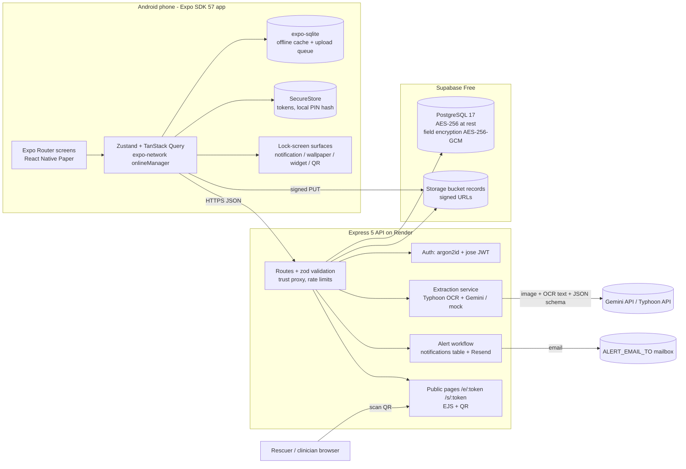

# MediFirstCard — Implementation Plan for Claude Opus 4.8 (v2.1, right-sized, free AI stack)

Version 2.1 · 2026-09-03 · Written by Claude Fable 5.1 · Executor: Claude Opus 4.8 + the 3-student team
Scope note: v2.0 is the trimmed, buildable version of the reviewed full plan in `docs/PLAN-full.md` (v1.1.1). Everything technical kept here was verified in `docs/research/*.md` (package versions checked on npm 2026-09-03). When this plan is silent, look in `docs/PLAN-full.md` first, then the research files. Deviations go in `docs/decisions.md`.

---

## 0. How to use this plan (read first, Opus)

**What you are building.** A good, working Android app for a university mini project: (1) an emergency health card on the lock screen with user-chosen fields, (2) a PIN-protected archive of scanned medical certificates with AI extraction of the fields, and (3) an encrypted Express + PostgreSQL backend with QR/link sharing for rescuers and clinicians. Live demo **Wed 7 Oct 2026**; repository due **Sun 11 Oct 2026 23:59**. Target effort ≈ 20 agent-days; do not add features beyond §3.

**Ground rules.**
1. Work week by week (§12); gates are on-phone acceptance items. Design artefacts and docs never block code.
2. Install native packages only with `npx expo install <pkg>` from `apps/mobile`. Never `npm i` Reanimated, Gesture Handler, Skia or `react-native-svg` directly.
3. Never fake an integration in the demo or in README claims. A labelled `mock` extraction provider and a `local` storage adapter **are required** for tests and key-less local runs; mock output carries `warnings: ["mock provider"]`.
4. A feature is done only when a student has seen its acceptance items pass on a physical Android phone.
5. Commits carry student identity (IPAC is graded). Opus never commits under its own name. DEV is the only programmer: DEV reviews, commits and pushes all code from their own account with `Co-authored-by: Claude Opus 4.8 <noreply@anthropic.com>`. PM and UX know Git and some coding: they commit their own files (docs, i18n JSON, design assets, sample documents, test reports) and small bounded code tasks (theme tokens, the consent/about/privacy screens, fixtures, bug fixes) through pull requests that DEV reviews, at least twice a week; check `git shortlog -sn` at every gate. README §2 says: "Implementation was AI-assisted (Claude), directed and reviewed by the lead developer; each member committed the files they own."
6. Keep the educational-prototype disclaimer visible (onboarding, About, card footer, public pages, PDF, README). Never phrase output as diagnosis or treatment advice.
7. When something is impossible, apply the fallback in §16, log it in `docs/decisions.md`, continue.
8. Thai is the primary UI and legal language; English secondary. Store ISO 8601 (CE) dates; display Buddhist Era.
9. Ask the team only the questions in §17, once; otherwise use the stated assumption.
10. If an acceptance item stays red for more than one working day: tag the week anyway, carry the item to the top of the next week, log it, tell DEV.
11. DEV may run two Opus sessions in parallel (branches `api/*` and `mobile/*`) once `packages/shared` is frozen at the end of W1; one session is fine too.
12. At the end of each week Opus writes `docs/walkthrough/<module>.md` (purpose, flow, key files, 5 likely grader questions with answers); DEV presents it to PM and UX, who read the code with it and must each be able to explain the module in plain words for Q&A (logged in `docs/worklog.md`). Technical understanding is 7.5 of 40 points.

---

## 1. Project snapshot

| Item | Value |
|---|---|
| Deliverables left | Video + live demo 7 Oct (peer 10 + instructor 5 pts); GitHub repo + README 11 Oct (20 pts) |
| Team | ปิยนุช นุ่มน้อย (**PM** / System Analyst: docs, testing, logistics, small code tasks) · เหม่หลิ๋ง ตัน (**UX** + medical consultant: design, content, samples, video, small code tasks) · ณัฐพัชร์ ทัศนะเมธี (**DEV**, lead and main programmer) · **OPUS** (implementation under DEV) |
| Dev machine | Windows 10 Pro, Node 24.15.0, Java 21 present (install JDK 17, set `JAVA_HOME`), adb present, `ANDROID_HOME` unset. No Xcode → **Android only**; iOS documented, not built. |
| Budget | $0 (no-card free tiers only) |
| Proposal promises graders check | Lock-screen emergency card (widget), records archive with camera scan, password-protected access, Express REST API, PostgreSQL encrypted at rest and in transit, user-chosen lock-screen fields, OCR optional |
| Rubric hard rules | RN app that runs; ≥3 screens + navigation; ≥1 input/data source; dashboard; healthcare context; GitHub + README; screenshots/video; prototype disclaimer; **≥5 advanced features from ≥3 categories, ≥2 genuine integrations** |

Calendar: W1 Thu 3–Wed 9 Sep (setup + spikes) · W2 Thu 10–Wed 16 · W3 Thu 17–Wed 23 · W4 Thu 24–Wed 30 (**demo-scope freeze Sun 27; code freeze + Rehearsal 0 Wed 30**) · W5 Thu 1–Tue 6 Oct (Rehearsal 1 Fri 2, video cut Sat 3, Rehearsals 2–3 Mon 5–Tue 6) · Wed 7 Oct demo · Thu 8–Sun 11 Oct docs.

---

## 2. Locked decisions

### 2.1 Scope and the telemedicine question
Thai Medical Council notice 54/2563 limits telemedicine to licensed facilities, so MediFirstCard is a **bridge**: the patient can hand a clinician a time-limited link to selected records and the summary. No video/chat, e-prescription, booking, symptom checker or diagnostic AI. Video and README headline the proposal's three pillars; the bridge is an "additional feature".

### 2.2 Official advanced features (declare exactly these six; each is defined by MUST items only)

| # | Feature (README/video wording) | Category | Genuine integration |
|---|---|---|---|
| A1 | Custom Express 5 + TypeScript REST API with JWT auth, hosted on Render | 2 API/Backend | **Yes** |
| A2 | Supabase PostgreSQL + Storage: structured schema with timestamps and metadata, AES-256-GCM encryption of all health-content text, signed-URL uploads, SHA-256 duplicate detection | 1 Data & Storage | **Yes** |
| A3 | AI document extraction: Thai OCR (Typhoon OCR by SCB 10X) plus a vision LLM (Google Gemini) read a Thai/English medical certificate into structured fields with a per-field confidence score and an evidence snippet; the user reviews before saving | 4 AI/ML | **Yes** |
| A4 | Automated alert workflow: viewing the public emergency card fires a backend event → in-app notification + email to the configured alert address | 2 Automation | **Yes** |
| A5 | PDPA consent screen, role-based views (owner / rescuer / clinician), clinically meaningful status labels, elderly-first accessibility | 5 Medical UI/UX | No |
| A6 | Offline-first local storage (expo-sqlite + SecureStore) with an upload queue, plus PDF emergency-card export | 1 Data & Storage | No |
| Additional (list if shipped) | Android App Widget with lock-screen hub (proposal core); clinician share link; "explain this document" chat; 1669 call script; local expiry reminders; JSON (FHIR-lite) export | — | — |

Categories 1, 2, 4, 5; four genuine integrations. Do not claim Category 3, Node-RED or n8n. README "Sensors" line: "Device camera (document capture) and GPS (1669 call script) via OS APIs; no IoT sensor — Category 3 not claimed."

### 2.3 Stack (versions verified 2026-09-03)

**Mobile (`apps/mobile`)** — Expo SDK 57 (`expo@57.0.19`, RN 0.86.3, React 19.2.3, New Architecture, Hermes V1); development build via `npx expo run:android`; Expo Go not used.

| Concern | Package | Notes |
|---|---|---|
| Dev client | `expo-dev-client` ~57.0.18 | Development builds via `npx expo run:android` |
| Routing | `expo-router` ~57.0.18 | Import `Stack`/`Tabs` from `expo-router`; never `@react-navigation/*` in app code |
| UI kit | `react-native-paper` 5.15.3 + `react-native-safe-area-context` (pinned) | Material 3, dark theme built in; check TextInput/Modal/Menu on device in W1 |
| Icons | `@expo/vector-icons` (bundled; MaterialCommunityIcons) + `healthicons-react-native` 3.5.0 + `react-native-svg` 15.15.4 (pinned) | `@expo/vector-icons` is deprecated since SDK 56 but bundled and maintained; migrate only if time allows |
| Fonts | `@expo-google-fonts/sarabun` 0.4.1 + `expo-font` + `expo-splash-screen` | Sarabun for Thai and Latin; weights via family name, never `fontWeight` |
| Animation | `lottie-react-native` 7.5.0 | Splash heartbeat + upload success only; respect reduce-motion |
| State | `@tanstack/react-query` 5.102.8 · `zustand` 5.0.15 | Query for API data (`onlineManager` from `expo-network`); Zustand for session, locale, lock-screen settings |
| Forms | `react-hook-form` 7.87.0 + `zod` 4.5.4 + `@hookform/resolvers` 5.9.1 | Schemas in `packages/shared` |
| Local DB | `expo-sqlite` ~57.0.2 (raw SQL, in-code migrations; `expo-sqlite/kv-store`) | SQLCipher off (encryption is server-side) |
| Secure / biometrics / crypto | `expo-secure-store` ~57.0.3 · `expo-local-authentication` ~57.0.2 · `expo-crypto` (version from `npx expo install`) | Tokens, local PIN hash; SHA-256 for duplicates |
| Network state | `expo-network` ~57.0.1 | Offline banner, queue flush |
| Images | `expo-image-picker` ~57.0.15 · `expo-image-manipulator` ~57.0.15 | `ImageManipulator.manipulate(uri).resize(portrait ? {height:1600} : {width:1600}).renderAsync()` → `saveAsync({format: SaveFormat.JPEG, compress: 0.85})`; no `expo-camera` |
| Files / PDF / gallery | `expo-file-system` ~57.0.6 (class API) · `expo-print` ~57.0.1 · `expo-sharing` ~57.0.17 · `expo-media-library` ~57.0.4 (`Asset.create`) | |
| Lock screen | `expo-notifications` ~57.0.16 · `react-native-view-shot` 5.1.0 (pinned) · `react-native-android-widget` 0.22.1 · `react-native-qrcode-svg` 6.3.22 | §9 |
| Location / calls | `expo-location` (version from `npx expo install`) · `expo-linking` | 1669 script; `tel:` |
| i18n / dates | `i18next` 26.4.1 · `react-i18next` 17.0.13 · `expo-localization` ~57.0.1 · `dayjs` 1.11.23 (+ `buddhistEra`, `locale/th`) | Never `Intl` Buddhist calendar on Hermes |
| Validation helpers | `thai-id-validator` 1.1.7 | |
| Tests | `jest-expo` ~57.0.5 · `@testing-library/react-native` 14.0.1 (install `test-renderer` ^1.0.0 if asked) | |

Do not use: Notifee, `expo-barcode-scanner`, `expo-av`, `react-test-renderer`, `react-native-document-scanner-plugin`, unpinned Reanimated 4.6 / Gesture Handler 3 / Skia 2.11, `@react-navigation/*` imports, Expo Go.

**API (`apps/api`)** — Node 24 (`.nvmrc` 24; `engines >=22`; Render `NODE_VERSION=24`), TypeScript 5.9, ESM.

| Concern | Package |
|---|---|
| HTTP | `express` 5.2.1 · `@types/express` 5.0.6 · `helmet` 8.3.0 · `cors` 2.8.6 · `express-rate-limit` 8.7.0 |
| Validation / logging | `zod` 4.5.4 (shared) · `pino` 10.3.1 + `pino-http` |
| DB | `drizzle-orm` 0.45.2 · `drizzle-kit` 0.31.10 · `pg` 8.23.0 |
| Auth / crypto | `argon2` 0.45.1 (Argon2id m=19456,t=2,p=1) · `jose` 6.2.10 (HS256; access 15 min; refresh 30 d rotated, hashed) · Node `crypto` AES-256-GCM |
| Uploads / images | `multer` 2.3.0 (profile photo) · `file-type` 22.0.2 · `sharp` 0.35.4 |
| Storage / mail | `@supabase/supabase-js` 2.114.0 · `resend` (pin with `--save-exact`) |
| AI | `@google/genai` 2.21.0 (Gemini); Typhoon OCR via native `fetch` |
| Public pages / QR | `ejs` 3.1.10 · `qrcode` 1.5.4 |
| Tests / tooling | `vitest` 4.1.11 · `supertest` 7.2.2 · `tsx` 4.23.13 · `esbuild` 0.28.2 |

**Services (all $0, no card)**

| Service | Role | Limit that matters | Mitigation |
|---|---|---|---|
| Supabase Free (Singapore) | PostgreSQL 17 + private bucket `records` | 500 MB DB, 1 GB files; **pauses after 7 idle days**; `DATABASE_URL` must be the **Session pooler** URI (port 5432, host `aws-0-<region>.pooler.supabase.com`, user `postgres.<ref>`) — the direct URI is IPv6-only | UptimeRobot 5-min ping (a 5-minute setup) so a quiet week does not pause it; if it pauses anyway, restore it from the dashboard before the demo |
| Render Free | Express API `https://medifirstcard-api.onrender.com` | Sleeps after 15 min idle (~1 min wake); reverse proxy (`trust proxy`) | UptimeRobot; pre-warm; never Render's free Postgres |
| UptimeRobot Free · GitHub public repo · Expo (EAS fallback, 15 builds/month) | Keepalive · code/CI/Releases · cloud build fallback | — | — |
| Resend Free | Alert email | **Without a verified domain, mail only reaches the Resend account owner's address** (verify in W1) | `ALERT_EMAIL_TO` = that address; README limitation |
| Google Gemini API free tier | Extraction: image + OCR text → JSON with per-field confidence (`gemini-2.5-flash-lite` default; `gemini-2.5-flash` for better Thai) | No card; limits shown only in AI Studio (reported ~15 RPM / 1,000 requests per day for Flash-Lite); free tier uses inputs to improve Google products → **synthetic documents only** | `mock` fallback; per-day counter; read the real limits in W1 |
| Typhoon API (SCB 10X) | Thai OCR text layer (`typhoon-ocr`), free "research showcase" | 20 requests/min; usage data collected to improve the model | `OCR_PROVIDER=none` disables it; synthetic documents only |
| cloudflared quick tunnel / phone hotspot | Demo fallback for API calls | Random URL | Server URL setting (F31) |

### 2.4 Lock-screen strategy (proposal headline)
One privacy object `lockScreenFields` drives every surface (§9):
- **Tier 1, guaranteed (W2):** sticky public-visibility notification card (Android 13+ permission prompt; text visible without unlocking when the phone shows notification content on the lock screen, collapsed to 1–2 lines; tapping needs unlock) + **wallpaper card** (view-shot PNG saved to the gallery, guided "set as lock screen") + **QR to the public page** `/e/<token>`. PDF card in W3.
- **Tier 2, likely (W1 spike, JS in W2):** Android home-screen App Widget via `react-native-android-widget`; on Pixel phones with Android 16 QPR2+ and on the API 36.1 emulator image the same widget is placeable on the lock-screen widget hub with no extra code. If spike S-A passes, the module is part of the frozen native shell.
- **Documented only:** iOS `expo-widgets`, Quick Settings tile, foreground-service card.
Wording everywhere: "Lock-screen widget: Pixel Android 16 QPR2+ (and emulator); other Android phones get the lock-screen notification card and wallpaper card; visibility depends on the phone's lock-screen notification setting."

### 2.5 AI strategy
Server-side, $0, no card: **Typhoon OCR** (SCB 10X, Thai-specialised, free API) produces the text layer, and **Google Gemini** (free tier, `gemini-2.5-flash-lite`) turns image + OCR text into JSON with per-field `{value, confidence, evidence}`, which gives the confidence score and explainability in one call. `mock` serves fixtures for tests, key-less runs and the provider-down fallback. On-device ML Kit cannot read Thai and tesseract Thai is unusable. Both free tiers may use inputs to improve their services, so all demo documents are synthetic. §10.

### 2.6 Visual identity
Clinical blue `#005B96`; red only for allergies/urgent (`#B3261E`); status triad normal/caution/urgent as colour + icon + text; Sarabun; body ≥18 sp, card values 26 sp bold, 48 dp targets; light default, dark supported; unDraw illustrations. Tokens: `docs/research/research-ui-kit.md` §6.3 → `apps/mobile/src/theme/tokens.ts` verbatim.

---

## 3. Feature list

**MUST** ships by the code freeze (Wed 30 Sep); **SHOULD** if the previous week ended on time; **COULD** only after all MUST/SHOULD are demo-ready; **OUT** = Future development.

**Demo core** (on the release build by Sun 27 Sep): F01–F06, F11–F13, F15, F16, F17 (PDF card), F22, F23, F26–F31, plus F07 if spike S-A passed. F28 (consent) and F31 (Server URL) appear in the video and the fallback drill rather than in the main demo script.

### 3.1 Emergency card & lock screen
| ID | Feature | Pri | Cat | Demo moment |
|---|---|---|---|---|
| F01 | Emergency profile: name (TH/EN), age from DOB, sex, photo, blood group ABO+Rh, drug allergies (drug, reaction, severity, source), chronic conditions (Thai pick-list + free text), critical medications, flags (anticoagulant, insulin, pacemaker, dialysis, pregnancy), 2 emergency contacts with "I have informed them" checkbox, insurance scheme, preferred language, explicit "no known drug allergies" | MUST | 1, 5 | Add penicillin allergy, severity "severe" → red chip |
| F02 | Emergency Card (owner) and Rescuer view: large type, red-flag order (allergies → conditions → meds → contacts), tap-to-call, "self-reported, last updated" footer, TH+EN | MUST | 5 | Show card; switch language |
| F03 | Lock-screen field picker with live preview + exposure warning | MUST | 5 | Toggle "medications" off → preview and notification update within 1 s |
| F04 | Notification card (sticky, public; permission requested) with master switch | MUST | 5 | Lock the phone → blood group + top allergy readable |
| F05 | Wallpaper card: 1080×2400 PNG saved to gallery + guided "set as lock screen" | MUST | 5 | Lock screen shows the card image |
| F06 | Emergency QR + public page `/e/<token>`; one active emergency link per user (rotate = SHOULD) | MUST | 2 INT | Second phone scans the wallpaper QR → page loads from Render |
| F07 | Android App Widget (home screen; Pixel A16 QPR2 / AVD lock-screen hub) | SHOULD (MUST if S-A passed) | 5 / OS | Add widget; AVD lock-screen widget page |
| F08 | "Call 1669" button + call-script screen (age/sex, conscious/breathing, GPS, callback number, TH/EN) | SHOULD | 5 | Dialer opens with 1669 prefilled (do not call) |
| F09 | SOS share with location · Quick Settings tile · iOS widget | OUT | — | Documented |

### 3.2 Records & archive
| ID | Feature | Pri | Cat | Demo moment |
|---|---|---|---|---|
| F11 | Capture: camera/gallery → compress → client SHA-256 → `POST /records` (409 duplicate) → signed PUT → `confirm` (server normalises, blur check) → record with type, hospital, doctor, dates (BE), notes | MUST | 1, 2 INT | Photograph a synthetic certificate; encrypted row appears in Supabase |
| F12 | Timeline: list by date, filter by type, search, detail with image, "valid until" badge, delete (row + object) | MUST | 1 | Filter "certificate"; delete a test record |
| F13 | AI extraction: `POST /records/:id/extract` → review screen with confidence chips (green ≥0.85 / amber / red <0.6), evidence per field, inline edit, save; error states blurry / not medical / low confidence / provider down (mock chip) | MUST | 4 INT | Smudged sample → red licence field corrected |
| F14 | "Explain this document" in plain Thai (from extraction JSON; never diagnosis) | SHOULD | 4 | Ask "ต้องพักกี่วัน" |
| F15 | Offline-first: card + records metadata in SQLite; local PIN; upload queue; offline banner; auto-flush on reconnect | MUST | 1 | Airplane mode → PIN unlock → records open; add record → queued → synced within 10 s |
| F16 | Validation both sides: required fields, ranges, blood group enum, phone, Thai ID checksum, future dates, duplicate SHA-256 | MUST | 1 | Empty form / future DOB / bad Thai ID → errors; same photo → 409 |
| F17 | PDF emergency card with QR (MUST); PDF records summary with limitations + JSON FHIR-lite export (SHOULD) | MUST/SHOULD | 1, 5 | Share sheet with the PDF |
| F18 | Local expiry / follow-up reminders (expo-notifications scheduled on device) | SHOULD | 2 | Scheduled reminder listed in Settings |
| F19 | Vaccination module, edge-detecting scanner, vitals, sensors, image classification | OUT | — | Future work |

### 3.3 Sharing and alerts
| ID | Feature | Pri | Cat | Demo moment |
|---|---|---|---|---|
| F21 | Clinician share link `/s/<token>`: chosen records + summary, 24 h expiry, revoke; passcode + max views optional | SHOULD (first SHOULD to build) | 2 INT, 5 | Open on laptop → clinician view; revoke → "expired" |
| F22 | Notifications + access log screen ("who viewed my card") | MUST | 1, 5 | Shows the F06 scan with time and outcome |
| F23 | Alert workflow (A4): public view → `card.viewed` → `notifications` row → Resend email to `ALERT_EMAIL_TO` | MUST | 2 INT | Notifications screen updates; API log `alert.email sent`; mailbox bonus |
| F24 | Prepare-for-consult summary = the PDF records summary (F17 SHOULD) · telemedicine directory (static list with disclaimer) | COULD | 5 | — |

### 3.4 Security, privacy, platform
| ID | Feature | Pri | Cat | Demo moment |
|---|---|---|---|---|
| F26 | Account: email + password (argon2id), JWT access/refresh rotation, logout everywhere; password reset OUT (documented) | MUST | 2 | — |
| F27 | Local PIN gate (6 digits, hashed on device), biometric unlock, auto-lock 2 min, lock-out 60 s after 5 failures (prototype value, documented) | MUST | 5 | Wrong PIN ×5 → lock-out; wait 60 s |
| F28 | PDPA consent (separate explicit checkbox; purposes 1–3 incl. AI provider; retention; withdraw) stored with version + timestamp; privacy notice TH/EN at `/privacy` and in-app; account deletion | MUST | 5, 1 | First launch; `consents` row |
| F29 | AES-256-GCM encryption of every health-content text column (§5); TLS; secrets in env | MUST | 1, 2 | `substance_en_enc` base64 in Supabase |
| F30 | Home dashboard: card completeness %, counts, records by type, last sync, pending uploads, next expiry, next steps | MUST | rubric | Landing screen |
| F31 | Settings: language, large text, dark mode, **Server URL override** (kv key `apiBaseUrl`), AI extraction on/off, About | MUST | 5 | Server URL → laptop; next request hits the laptop log |
| F32 | Multi-profile, guardian consent, Mor Prom/Health Link, ThaID, push notifications | OUT | — | Limitations |

---

## 4. Architecture



**Repository (npm workspaces, single root lockfile).** Create the git repository at the short path `C:\mfc` (move the contents of `C:\workspace\MediFirstCard` there, or clone there; no junction). Always build from `C:\mfc\apps\mobile`.
```
MediFirstCard/
  package.json            {"private":true,"workspaces":["apps/*","packages/*"]}   .nvmrc = 24
  README.md  PLAN.md  LICENSE  CONTRIBUTORS.md  docker-compose.yml  render.yaml
  .github/workflows/api-ci.yml  mobile-ci.yml
  docs/  architecture.md  decisions.md  worklog.md  demo-script.md  qa-sheet.md  handout.md  walkthrough/  screenshots/  research/  PLAN-full.md
  packages/shared/        {"name":"@mfc/shared","private":true,"type":"module","main":"./src/index.ts","types":"./src/index.ts"}
    src/  schemas/ (zod: profile, allergy, condition, medication, contact, record, extraction, shareLink)  i18n/{th,en}.json  card/buildCardPayload.ts  dates/  index.ts
  apps/mobile/            Expo app (§7); depends on "@mfc/shared": "*"; SDK 57 auto-configures Metro for workspaces (no watchFolders)
  apps/api/               Express API; depends on "@mfc/shared": "*"
    src/ server.ts  app.ts  config/env.ts  db/{index,schema,seed,encryptedFields}.ts  crypto/fieldEncryption.ts  auth/{password,tokens,middleware}.ts
         middleware/{validate,rateLimit,errorHandler}.ts  modules/{auth,profile,records,extract,share,public,alerts,notifications,consent,health}
         extract/providers/{gemini,typhoon,mock}.ts  extract/{pipeline,confidence}.ts  storage/{supabase,local}.ts  views/{emergency,clinician,privacy}.ejs
    test/  fixtures/  drizzle/  .env.example  Dockerfile
```
API build: `esbuild src/server.ts --bundle --platform=node --target=node22 --format=esm --outfile=dist/server.mjs --packages=external --alias:@mfc/shared=../../packages/shared/src/index.ts`. Render: Root Directory blank; Build `npm ci --include=dev && npm run build -w apps/api && npm run db:migrate -w apps/api`; Start `npm start -w apps/api`; Health `/health`; `NODE_VERSION=24`. CI: root lockfile, `npm ci`, `npm run lint -w apps/api && npm run db:migrate -w apps/api && npm test -w apps/api`, service image `postgres:17-alpine`.

---

## 5. Data model (PostgreSQL via Drizzle; ★ mirrored in mobile SQLite)

| Table | Key columns (all: `id uuid pk`, `created_at`, `updated_at`) |
|---|---|
| users | email unique, password_hash, locale, consent_version, consented_at |
| emergency_profiles ★ | user_id unique, first_name_th_enc, last_name_th_enc, name_en_enc, dob, sex, photo_path, blood_abo enum(A,B,AB,O,unknown), blood_rh enum(pos,neg,unknown), no_known_drug_allergy bool, flags jsonb, insurance_scheme enum, preferred_language, notes_enc, lock_screen_fields jsonb, last_reviewed_at |
| allergies ★ | user_id, substance_en_enc, substance_th_enc, category enum, reaction_enc, severity enum(mild,moderate,severe), source enum(self,hospital_card), noted_at |
| conditions ★ | user_id, code (ICD-10 plain), label_th_enc, label_en_enc, status enum(active,resolved), onset_year, critical bool |
| medications ★ | user_id, name_enc, strength_enc, dose_enc, frequency_th_enc, critical bool, status enum(active,stopped) |
| emergency_contacts ★ | user_id, name_enc, relationship, phone_enc, informed_consent bool, priority |
| medical_records ★ | user_id, kind enum(certificate_general, certificate_driving, certificate_5disease, sick_leave, prescription, lab, vaccine, allergy_card, discharge, receipt, other), status enum(pending, uploaded, extracted, reviewed), title_enc, facility_enc, doctor_name_enc, doctor_license_no_enc, issued_at, valid_until, storage_path, mime, size_bytes, sha256 (unique per user), notes_enc; mobile-only: sync_status, local_uri |
| extractions | record_id fk not null, provider, model, source enum(live,mock), raw_text_enc, extraction_json_enc, field_meta jsonb, image_quality, latency_ms, tokens_in, tokens_out, reviewed_at |
| share_links | user_id, token_hash unique, scope enum(emergency,records), record_ids uuid[], expires_at (null for emergency), revoked_at, max_views, view_count, passcode_hash, failed_passcodes |
| share_access_log | share_link_id, accessed_at, ip inet, user_agent, outcome enum(ok,expired,revoked,not_found,bad_passcode) |
| consents | user_id, version, purposes jsonb, granted bool, at |
| refresh_tokens | user_id, token_hash, expires_at, revoked_at, replaced_by |
| notifications | user_id, kind enum(card_viewed, share_viewed, share_revoked), payload jsonb, read_at |
| deleted_users | email_hash, deleted_at (30-day tombstone after `DELETE /me`) |

Rules:
- **Encrypted:** every `*_enc` column (all health-content text) via `crypto/fieldEncryption.ts` (AES-256-GCM, 12-byte IV, tag stored, key `FIELD_ENC_KEY`) with the column list in `db/encryptedFields.ts`. Plain: enums, booleans, ids, dates, ICD-10 codes, blood group enums, `lock_screen_fields`, storage paths. The API decrypts for owner and public views; filters use plain columns. README carries this table.
- `lock_screen_fields` = `{name, bloodType, allergies, conditions, medications, contact}`; defaults `{name:true, bloodType:true, allergies:true, conditions:false, medications:false, contact:true}`; the public renderer filters by it at request time.
- `kind` ← extraction `document_type`: `medical_certificate_sick_leave→sick_leave`, `medical_certificate_5_disease→certificate_5disease`, `prescription|medication_label→prescription`, `lab_result→lab`, `receipt→receipt`, `other_medical→other`, `not_medical→` no change (200 + warning; manual entry offered). `valid_until` default = `issued_at + 1 month` for `certificate_*` and `sick_leave`.
- `DELETE /me` = hard delete (cascade) + async storage purge + tombstone.

---

## 6. API contract

JSON routes under **`/api/v1`**. Unprefixed: `GET /health` (`{ok, version, uptime, ip, extractProvider, storageProvider}`), `GET /health/db`, `GET /privacy`, `GET /e/:token/qr.png`, `GET /e/:token.json`, `GET /e/:token`, `GET|POST /s/:token`. Register `/qr.png` and `.json` **before** `/e/:token`. Errors `{code, message, details?}`. Protected routes: `Authorization: Bearer <access>`; the in-app PIN gate (local) guards the archive screens, not the API.

| Method & path | Purpose | Notes |
|---|---|---|
| POST /auth/register · /auth/login · /auth/refresh · /auth/logout `{all?: boolean}` | Accounts | login 10/15 min per IP+email; `all=true` revokes every refresh token ("logout everywhere") |
| GET /me · GET/PUT /me/profile · POST /me/profile/photo | Session; emergency profile; photo (multipart, 2 MB) | |
| GET/POST/PUT/DELETE /me/allergies · /me/conditions · /me/medications · /me/contacts | Sub-collections | zod from `@mfc/shared` |
| PUT /me/lock-screen-fields · GET /me/emergency-card · POST /me/emergency-card/rotate (SHOULD) | Privacy object; card payload `{lines, emergencyUrl, qrPngDataUrl, shareLinkId}` (lazily creates the single emergency link; `shareLinkId` feeds the access log) | |
| POST /records `{kind?, sha256, sizeBytes, mime}` → 409 `DUPLICATE_RECORD` or `{recordId, signedUploadUrl, token}` · POST /records/:id/confirm · GET /records · GET /records/:id · PUT /records/:id · GET /records/:id/url (5-min signed) · DELETE /records/:id | Archive | confirm: download once with the service-role key, `sharp.rotate().resize(1600).jpeg({quality:85})` (strips EXIF), Laplacian blur score → 422 `IMAGE_BLURRY`, rewrite object, status `uploaded` |
| POST /records/:id/extract (header `X-Consent-Version`) → `{extractionId, extraction, fieldMeta, warnings, source}` · PUT /records/:id/extraction · POST /records/:id/explain `{question}` → `{answer}` (SHOULD) | AI (§10) | `source: live|mock` |
| POST /share-links `{recordIds[], ttlHours=24, passcode?, maxViews?}` · GET /share-links · GET /share-links/:id · POST /share-links/:id/revoke · GET /share-links/:id/log | Sharing | |
| GET /e/:token (+.json, /qr.png) | Public emergency view; 30/min per IP+token; HTML/JSON hits log access and fire `card.viewed`; qr.png does neither | `?lang=th|en` |
| GET /s/:token · POST /s/:token | Clinician view (+passcode if shipped; 5 bad → auto-revoke + `share_revoked` notification) | |
| GET /me/notifications · POST /me/notifications/:id/read | Alerts | |
| GET /me/export.json (SHOULD) | FHIR-lite bundle | |
| POST /me/consent · GET /me/consent · DELETE /me | PDPA | withdrawal revokes all share links |

### 6.1 Environment variables (`config/env.ts` validates; `.env.example` mirrors this)

| Name | App | Required | Example / default |
|---|---|---|---|
| DATABASE_URL · PGSSL | api | yes · no | Session pooler URI · `disable` locally |
| JWT_SECRET · FIELD_ENC_KEY | api | yes | 32 random bytes base64 |
| STORAGE_PROVIDER · SUPABASE_URL · SUPABASE_SERVICE_ROLE_KEY · SUPABASE_BUCKET | api | no · when supabase | `local` (dev/CI) or `supabase` (Render); bucket `records` |
| EXTRACT_PROVIDER · GEMINI_API_KEY · GEMINI_MODEL · OCR_PROVIDER · TYPHOON_API_KEY | api | no · when gemini · no · no · when typhoon | `gemini` (default) or `mock` · AI Studio key · `gemini-2.5-flash-lite` · `typhoon` (Render) or `none` (CI) · key from playground.opentyphoon.ai |
| RESEND_API_KEY · ALERT_EMAIL_TO · RESEND_FROM | api | no (set on Render) | unset → row inserted, log `alert.email skipped`; `ALERT_EMAIL_TO` = Resend owner; `onboarding@resend.dev` |
| PUBLIC_BASE_URL · CORS_ORIGINS · TRUST_PROXY · PORT | api | yes · no · no · no | Render URL (QRs always use it) · `*` dev · `1` Render / `0` local · `3000` |
| SEED_DEMO_EMAIL · SEED_DEMO_PASSWORD | api | for seed | demo email = `ALERT_EMAIL_TO` |
| EXPO_PUBLIC_API_URL | mobile | yes | baked default; runtime override via kv key `apiBaseUrl` |

---

## 7. Screens (Expo Router, `apps/mobile/app/`)
```
_layout.tsx                 PaperProvider, QueryClient (+onlineManager), i18n, fonts, auth gate, PIN gate
(onboarding)/welcome.tsx  consent.tsx  register.tsx  login.tsx  set-pin.tsx
(tabs)/_layout.tsx          Home · Card · Records · More
(tabs)/index.tsx            Home dashboard (F30)
(tabs)/card/index.tsx       Emergency card (F02): lock-screen setup, QR, PDF, 1669
(tabs)/records/index.tsx    Timeline (F12); FAB "Scan"
(tabs)/more/index.tsx       Sharing, notifications, export, settings, about
profile/edit.tsx  allergies.tsx  conditions.tsx  medications.tsx  contacts.tsx
lock-screen/fields.tsx (F03)  setup.tsx (F04/F05/F07 guides + phone settings check)
records/scan.tsx (F11)  review.tsx (F13)  [id].tsx  explain.tsx (F14)
share/new.tsx  [id].tsx (F21)   notifications/index.tsx (F22)
emergency/call-1669.tsx (F08)  rescuer/preview.tsx (no PIN; deep link medifirstcard://rescuer)
settings/index.tsx  server.tsx (F31)  privacy.tsx (notice, withdraw, delete)  about.tsx
```
W1 wireframes cover the eight W2 screens (welcome, consent, register/login, set-pin, home, card, profile/edit, lock-screen/fields); the rest use tokens + Paper defaults with a per-week UX pass.

---

## 8. Design system, i18n, accessibility
- Tokens from `research-ui-kit.md` §6.3; Paper MD3 themes with `configureFonts({ config: { fontFamily: 'Sarabun_400Regular' } })`.
- Status labels: colour + icon + text, always. Elderly-first: body 18, card values 26 bold, Thai line-height ≥1.5×, large-text toggle ×1.25, 48 dp targets, one primary action per screen.
- i18n: `packages/shared/i18n/{th,en}.json`; Thai first; card shows both; dates `dayjs().locale('th').format('D MMMM BBBB')` with CE in brackets.
- Legal strings verbatim from `research-landscape.md` §9 plus consent purpose (3): TH "ส่งภาพเอกสารไปยังผู้ให้บริการ AI (Google Gemini และ Typhoon ของ SCB 10X) เพื่อดึงข้อความ ผู้ให้บริการอาจใช้ข้อมูลเพื่อปรับปรุงบริการของตน" / EN "sending document images to AI providers (Google Gemini and SCB 10X Typhoon) for text extraction; the providers may use the data to improve their services". First-scan sheet names the provider (from `/health`); Settings has "AI extraction off".

---

## 9. Lock-screen delivery
Source of truth: `lockScreenFields` in Zustand, persisted in kv-store key `lockScreenFields`, mirrored to `emergency_profiles.lock_screen_fields`. `buildCardPayload(profile, fields)` in `@mfc/shared` returns the ordered lines every surface renders; the cached card lives in kv-store key `emergencyCard`.
1. **Notification (F04).** `requestPermissionsAsync()` (explain and keep the switch off if denied) → `setNotificationChannelAsync('emergency-card', { name, importance: AndroidImportance.LOW, lockscreenVisibility: AndroidNotificationVisibility.PUBLIC })` → `scheduleNotificationAsync({ identifier: 'emergency-card', content: { title: '<blood group> · <top allergy>', body, sticky: true, autoDismiss: false, data: { url: 'medifirstcard://rescuer' } }, trigger: null })`. Re-post on foreground and after changes; response listener routes `data.url` to `/rescuer/preview`; setup guide includes the phone-settings check.
2. **Wallpaper (F05).** Hidden 1080×2400 view (top third blank, card centre, QR bottom-right) → `captureRef(ref, { format: 'png', quality: 1, result: 'tmpfile' })` → `MediaLibrary.requestPermissionsAsync(true, ['photo'])` → `Asset.create(uri, album)` → instructions sheet.
3. **Widget (F07).** Plugin block and `index.ts` wiring per `research-expo-stack.md` §4; `widget-task-handler.tsx` imports only `react-native-android-widget`, kv-store and the palette; renders `FlexWidget`/`TextWidget`; `clickAction="OPEN_URI"` → `medifirstcard://rescuer`; `requestWidgetUpdate` after changes; `requestPinWidget()` button; no `not_keyguard`.
4. **Public page (F06).** EJS: red header (name, blood badge), allergy chips, conditions, meds, `tel:` contacts, self-reported footer, `?lang` toggle, no JS. Helmet on `/e` and `/s` with `styleSrc 'unsafe-inline'`. QR always encodes `PUBLIC_BASE_URL`; the share screen can render a temporary QR from the current Server URL for the tunnel drill. One active emergency link, created lazily by `GET /me/emergency-card`; consent withdrawal revokes it.
5. **Rescuer deep link.** `medifirstcard://rescuer` opens the read-only rescuer screen without PIN, filtered by `lockScreenFields`.

---

## 10. AI extraction (A3) and alert workflow (A4)
**Pipeline.** App: capture/pick → resize only when the long edge exceeds 1600 px or the file is not JPEG (fixtures are prepared as 1600 px JPEGs, so a picked fixture uploads unchanged and its hash matches) → reject < 800 px → `Crypto.digest(SHA256)` → `POST /records` → PUT → `confirm`. `POST /records/:id/extract`: API reads the stored object → `ocrText = await typhoonOcr(image)` (skipped when `OCR_PROVIDER=none` or on error) → `geminiExtract(image, ocrText)` → post-process (BE→CE dates, licence regex `ว\.?\s*\d{4,6}`, ICD-10 regex, rest-day arithmetic, agreement: a field's evidence found verbatim in the OCR text ×1.0, fuzzy match ×0.8, absent ×0.6, no OCR ×1.0) → `finalConfidence = llm × validator × agreement × quality` → insert `extractions` → respond. Review chips: green ≥0.85 "อ่านได้ชัดเจน", amber 0.60–0.85 "โปรดตรวจสอบ", red <0.60 "ไม่แน่ใจ กรุณาแก้ไข", grey null; tap → evidence quote; Save disabled until red fields are confirmed; banner "AI-extracted; verify before use; not medical advice"; "mock result" chip when `source=mock`.

**Schema and prompt.** From `research-ocr-ai.md` §5–6 verbatim; zod twin in `@mfc/shared/schemas/extraction.ts`.

**Providers** (`modules/extract/providers/`; env in §6.1; both free, no card).
- `typhoon` (Thai OCR text layer, `OCR_PROVIDER=typhoon`): `POST https://api.opentyphoon.ai/v1/chat/completions` with `Authorization: Bearer $TYPHOON_API_KEY`, body `{ model: 'typhoon-ocr', messages: [{ role: 'user', content: [{ type: 'text', text: TYPHOON_OCR_PROMPT }, { type: 'image_url', image_url: { url: 'data:image/jpeg;base64,' + data } }] }], max_tokens: 16384, temperature: 0.1, top_p: 0.6, repetition_penalty: 1.1 }` via native `fetch`. `TYPHOON_OCR_PROMPT` is the exact v1.5 prompt shipped in the `typhoon-ocr` Python package (copy it verbatim from `docs/research/research-free-ocr.md`; the model works with no other prompt). Returns Markdown text (HTML tables), never JSON. Limits 2 req/s and 20 req/min → on 429 back off 2/4/8 s, then continue without OCR text. Resize to ≤1800 px long edge before sending.
- `gemini` (structured extraction, default): `@google/genai` 2.21.0, `const ai = new GoogleGenAI({ apiKey: process.env.GEMINI_API_KEY })`; `ai.models.generateContent({ model: process.env.GEMINI_MODEL ?? 'gemini-2.5-flash-lite', contents: [{ role: 'user', parts: [{ text: userPrompt + (ocrText ? '\n\nOCR text (may contain errors):\n' + ocrText : '') }, { inlineData: { mimeType: 'image/jpeg', data } }] }], config: { systemInstruction: SYSTEM_PROMPT, responseMimeType: 'application/json', responseJsonSchema: EXTRACTION_SCHEMA, thinkingConfig: { thinkingBudget: 0 } } })` → `JSON.parse(res.text)` → zod. Text part before the image; `$defs`/`$ref` are supported; never use `minimum`/`maximum` in the schema (validate ranges in code); do not set `temperature` (deprecated July 2026). `gemini-2.5-flash` is the quality fallback for Thai (ROUGE-L 0.87 on Thai government forms in the Typhoon OCR paper). A 1600 px photo costs about 1,300 tokens. Client `timeout: 20_000` ms → mock with `warnings: ['timeout']`; 429 → back off 2/4/8 s, then mock; keep a per-day request counter (free tier reported at about 15 RPM and 1,000 requests per day for Flash-Lite — read the real numbers on aistudio.google.com/rate-limit in spike S-D).
- `mock`: fixture by SHA-256 for the 15 seeded samples; unknown hash → `fixtures/generic.json` with `warnings: ["mock provider", "unknown sample"]`. Fixture JPEGs are copied to both phones' galleries in W3; the provider-down drill picks the fixture from the gallery (a live capture never matches a stored hash).
- **Fallback chain:** gemini → mock → manual entry with the Typhoon text prefilled when available.
- **Data policy:** both free tiers may use inputs to improve their services and Gemini allows human review, so the demo and all testing use **synthetic documents only**; the consent screen names both providers; README §13 carries the provider table. Cost: $0.

**Explain (F14, SHOULD).** Gemini text call with the same key (no image); input = extraction JSON + question; simple Thai; never diagnose; ends with "หากมีข้อสงสัย โปรดปรึกษาแพทย์หรือเภสัชกร".

**Samples.** UX creates 10 synthetic certificates + 5 medicine labels (no real people), including one with a smudged licence number (red field) and one blurry photo (422); both are the scripted demo samples in `apps/api/fixtures/`.

**Alert workflow (A4).** `/e/:token` HTML/JSON hits emit `card.viewed` (kind `card_viewed`); `/s/:token` views emit `share.viewed`; passcode auto-revoke emits `share_revoked` → `modules/alerts`: insert `notifications` row (MUST) → Resend email to `ALERT_EMAIL_TO`, copy "ข้อมูลฉุกเฉินของคุณถูกเปิดดูเมื่อ 14:32 (Chrome on Android)" from user-agent only (MUST when the key is set; `payload` stores the intended user email for the README explanation).

---

## 11. Security and privacy
- Passwords argon2id; access 15 min / refresh 30 d rotated with reuse detection; tokens in SecureStore.
- **PIN (local).** Set-PIN stores in SecureStore `pin_hash` = 1,000 iterations of `Crypto.digest(SHA256, salt ‖ previous)` with a random 16-byte salt (expo-crypto has no PBKDF2; brute force is bounded by the lock-out). Failure counter `pin_failures` in SecureStore; 5 failures → 60 s lock (prototype value, documented; production would be longer). Auto-lock after 2 min in background. Biometrics: SecureStore item `pin_secret` with `requireAuthentication: true` holds the PIN and is replayed through the same check. Works offline; the API relies on the JWT.
- Field encryption per §5. Uploads: magic-byte allowlist, 10 MB, SHA-256 dedupe, private bucket, 5-minute signed URLs, EXIF stripped on confirm.
- Public tokens: 24 random bytes base64url, SHA-256 stored; emergency scope revocable; clinician scope 24 h; passcode (if shipped) argon2id, 5 failures → auto-revoke. Rate limits keyed by client IP (`app.set('trust proxy', 1)` on Render).
- PDPA: consent purposes 1–3, version stored; withdrawal revokes links; `DELETE /me` hard-deletes + purges + tombstone; `/privacy` notice; README provider data-handling table (Gemini free tier and Typhoon may use inputs to improve their services, and Gemini allows human review, so the project uses synthetic documents only).
- Disclaimers everywhere listed in rule 6. pino redacts `authorization`, `password`, `pin`; no raw OCR text at info level.

---

## 12. Week plan

### 12.0 Ownership (binding for who runs `git commit`)
| Owner | Folders / artefacts |
|---|---|
| **DEV** (main programmer) | Architecture and most code: `apps/api`, `apps/mobile/app` (except the screens below), `packages/shared/src` (schemas, card builder), native config, CI, releases; reviews every PR; presents the walkthroughs Opus drafts |
| **UX** (design + light code) | Figma wireframes; `apps/mobile/src/theme/tokens.ts`; `packages/shared/i18n/{th,en}.json`; `assets/` (illustrations, icons, Lottie); the consent, welcome and about screens (`app/(onboarding)/welcome.tsx`, `consent.tsx`, `app/settings/about.tsx`) built from DEV's scaffold; synthetic sample documents; `docs/screenshots`; video; handout layout |
| **PM** (docs + light code) | `docs/*` (README, architecture, decisions, worklog, qa-sheet, demo-script, handout text), `docs/test-plan.md` (manual checklist run on the phone weekly, results logged), `apps/api/fixtures/` and `db/seed.ts` data, `app/settings/privacy.tsx`, small bug fixes via PR, service accounts and env panels, demo-day logistics |
Each week ends with: PM runs the manual test checklist on the phone and logs results, a tagged pre-release, README section update, walkthrough docs, `git shortlog -sn` check, worklog entries; Opus adds ≥4 API + ≥3 mobile automated tests in each of W2–W4.

### W1 — Thu 3–Wed 9 Sep: setup, spikes, native shell frozen
1. OPUS: root `package.json` (workspaces), `.nvmrc`, `.gitignore`, LICENSE (MIT), CONTRIBUTORS, `docs/` skeleton, README skeleton in §15 order, ESLint + Prettier + strict TS; `packages/shared` with empty schema/i18n modules.
2. DEV: `choco install -y microsoft-openjdk17`; `JAVA_HOME` → JDK 17; Android Studio → SDK Platform 36 + **API 36.1 (Android 16 QPR2) image** + Pixel AVD; `ANDROID_HOME`; platform-tools on PATH; `LongPathsEnabled=1`; repo at `C:\mfc`; `org.gradle.jvmargs=-Xmx4096m` in `%USERPROFILE%\.gradle\gradle.properties`; `choco install -y postgresql17 cloudflared scrcpy` (Level 2 database, tunnel, screen mirroring); USB debugging; `adb devices`.
3. OPUS: `npx create-expo-app@latest apps/mobile --template default@sdk-57 --no-install`; `npm install` at root; from `apps/mobile`: `npx expo install` the Expo modules in §2.3 (dev-client, router, sqlite, secure-store, local-authentication, crypto, network, image-picker, image-manipulator, file-system, print, sharing, media-library, notifications, localization, font, splash-screen, location, linking) + `react-native-svg` + `react-native-view-shot` + `lottie-react-native`. `app.config.ts`: scheme `medifirstcard`, typed routes, plugins: `expo-router`, `expo-localization`, `["expo-sqlite",{"useSQLCipher":false}]`, `["expo-image-picker",{…}]`, `["expo-media-library",{…}]`, `expo-local-authentication`, `expo-secure-store`, `["expo-notifications",{"icon":"./assets/notification_icon.png","color":"#005B96","defaultChannel":"emergency-card"}]`, `["expo-font",{"fonts":[Sarabun 400/500/600/700]}]`, `expo-location`. `npx expo run:android` on phone + AVD.
4. OPUS: `apps/api` scaffold (`research-backend.md` §1 scripts with the workspace build from §4), `docker-compose.yml` (`postgres:17-alpine`), `app.ts` (trust proxy, helmet, cors, pino, error handler), `/health`, `/health/db`, `config/env.ts`, `storage/local.ts`, smoke test, `api-ci.yml`, `render.yaml`.
5. PM: Supabase project + bucket + **Session pooler URI**; Render service (§4 commands, env from §6.1); UptimeRobot on `/health/db`; Resend (one test send confirms the owner-only rule); Gemini key from Google AI Studio and Typhoon key from playground.opentyphoon.ai; secrets in a password manager. Ask the instructor §17 Q2.
6. Spikes (OPUS, ≤ half a day each, verdicts in `docs/decisions.md`): **S-A** widget on branch `spike/widget` (home screen + AVD lock-screen hub; merge into the shell if it passes); **S-B** notification on an Android 13+ phone; **S-D** one synthetic certificate through Gemini (`gemini-2.5-flash-lite` and `gemini-2.5-flash`) and Typhoon OCR via a throwaway `POST /spike/extract` route on Render (removed in W3): JSON validates, latency p50/p95, Thai accuracy on 3 samples, and the project's real limits copied from the AI Studio rate-limit page into decisions.md; and through `mock`; **S-G** offline: airplane → banner ≤2 s → queued insert → reconnect → flush ≤10 s; **S-H** release build `npx expo run:android --variant release` with a throwaway `apiBaseUrl` input (replaced by F31 in W2), then switch it to a cloudflared URL without rebuilding.
7. UX: wireframes for the eight W2 screens (welcome, consent, register/login, set-pin, home, card, profile/edit, lock-screen/fields); synthetic samples drafted. PM: `docs/test-plan.md` skeleton. DEV + OPUS: `packages/shared` schemas + i18n keys frozen.
Acceptance: dev build runs on phone + AVD; `GET /health` on Render returns the phone's public IP as `ip`; `/health/db` OK; CI green; three authors in `git shortlog -sn`; five spike verdicts written; `mfc-devclient-w1.apk` (`android/app/build/outputs/apk/debug/app-debug.apk`, attached to a pre-release; widget included if S-A passed) installed on all three phones and the AVD; W2–W4 are JS-only.

### W2 — Thu 10–Wed 16 Sep: identity, profile, card, lock screen, public page
1. API: auth, profile + sub-collections with field encryption, lock-screen-fields, emergency-card + lazy link, share tables, `/e/:token` (+`.json`, `/qr.png`, route order, CSP), consent, `/privacy`, `DELETE /me`, seed (demo user = `ALERT_EMAIL_TO`), migrations, tests.
2. Mobile: onboarding (consent incl. purpose 3, register/login, set PIN), auth + PIN gates + biometrics + auto-lock, profile editors (F01) with validation (F16), card + rescuer views (F02), field picker (F03), notification card (F04), wallpaper (F05), in-app QR (F06), widget renderer (F07 if in shell), dashboard (F30), settings incl. Server URL (F31), SQLite profile cache + offline banner (F15 part 1).
3. UX: visual pass on the built screens (feedback list; DEV applies); PM: screenshots v1, manual test checklist v1 run on the phone, README install/run tested on a second laptop; Opus drafts walkthroughs `auth.md`, `profile.md`, `lock-screen.md` and DEV presents them.
Acceptance: fresh install → consent → account → PIN → profile → card readable on the locked phone (notification + wallpaper) and tapping the notification opens the rescuer preview without PIN; toggling a field updates preview and notification within 1 s; second phone scans the QR → public page from Render and an access-log row exists; airplane mode → PIN unlock → card and profile open; empty form / future DOB / bad Thai ID → errors; Server URL → laptop log; Supabase shows `substance_en_enc` as base64 and one `consents` row; wrong PIN ×5 → 60 s lock-out; biometric unlock works; after 2 min in background the PIN screen returns; logout everywhere on phone A → phone B's refresh returns 401; card switches TH/EN; Home shows completeness %, counts and last sync.

### W3 — Thu 17–Wed 23 Sep: archive, storage, AI, alerts
1. API: records (create/confirm/list/get/update/url/delete, 409, sharp, blur 422), extract (gemini + typhoon + mock, pipeline, confidence, explain SHOULD), alerts + notifications, tests (records, extraction fixtures, alert emission).
2. Mobile: scan/upload (F11), timeline (F12), review (F13), explain (F14 SHOULD), upload queue + flush (F15 part 2), notifications screen (F22), PDF card (F17), first-scan provider sheet + AI-off toggle.
3. UX: 15 samples photographed on paper incl. smudged + blurry; fixtures copied to both phones; PM: extraction accuracy sheet for README; walkthroughs `records.md`, `extraction.md`, `alerts.md`.
Acceptance: photograph a sample → encrypted row → extraction reviewed and saved; smudged → red field; blurry → 422 with retake; same photo → 409; laptop API with `GEMINI_API_KEY=invalid` + fixture from gallery → mock chip, then manual entry; filter/search narrow the list; delete removes row + object; dashboard tiles update; offline record queued and synced ≤10 s; QR scan → notifications screen shows the alert and the API log shows `alert.email sent`; PDF card shares.

### W4 — Thu 24–Wed 30 Sep: sharing, polish, release build — scope freeze Sun 27, code freeze + Rehearsal 0 Wed 30
1. API (all SHOULD, in this order): clinician links (`/s/:token`, revoke, then passcode + max views), share list/log, rotate, export JSON.
2. Mobile: share/new + share/[id] (F21), access-log details (F22), 1669 script (F08 SHOULD), local reminders (F18 SHOULD); if S-A passed: widget lock-screen polish (F07) and AVD snapshot `demo-lockscreen` with the widget placed.
3. **Release build (Sun 27 Sep; rebuilt after fixes before Rehearsal 0):** in PowerShell from `C:\mfc\apps\mobile`: `$env:EXPO_PUBLIC_API_URL='https://medifirstcard-api.onrender.com'; npx expo run:android --variant release` → `android/app/build/outputs/apk/release/app-release.apk` (debug keystore acceptable; say so in README) → `gh release create v0.9.0 android/app/build/outputs/apk/release/app-release.apk --prerelease`; installed on demo phone, second phone, AVD; used in every rehearsal and on stage (dev client + Metro is the backup).
4. PM: `docs/architecture.md` (mermaid + PNG), README 80 %, `docs/demo-script.md` with the fallback matrix (§14), `docs/qa-sheet.md`, `docs/handout.md` text; UX: About, licences, empty states, dark-mode QA, handout layout.
5. **Rehearsal 0 (Wed 30 Sep)** on the release build, timed, with the Level 1 and Level 2 drills; afterwards only bug fixes to §14 features.
Cut order if behind: F24 → F18 → F08 → F17 JSON/summary → rotate → F14 → F21 → F07 only if S-A failed. Never cut F04/F05/F06.
Acceptance: [if F21 shipped] clinician link opens on a laptop, revoke → "expired" and logged; withdrawing consent revokes every link and the QR page shows "expired"; `DELETE /me` leaves only a tombstone; if S-A passed: widget on the home screen and on the AVD lock-screen hub; v0.9.0 APK on all devices; Rehearsal 0 timings in `docs/demo-script.md`.

### W5 — Thu 1–Tue 6 Oct: stabilise, video, rehearse, comprehension
1. Bug bash on two phones + AVD; 30-minute crash-free session; every error state in §13 checked.
2. Tests top-up to ≥10 mobile + ≥10 API; CI badges.
3. Comprehension: walkthrough presentations; Q&A sheet rehearsed; each presenter can name the code path they show; handout printed (§14).
4. Rehearsal 1 Fri 2 Oct (before the video lock); intro video cut Sat 3; full demo recording from Rehearsal 1; both uploaded unlisted; Rehearsals 2–3 Mon 5–Tue 6 (one on hotspot + cloudflared).
5. Demo-phone checklist: lock-screen notifications = show all content, screen timeout 10 min, DND/battery saver off, "stay awake while charging", notification permission granted; AVD snapshot ready; scrcpy tested.
6. Pre-warm checklist for 7 Oct (T-30/T-10 min): UptimeRobot up, Supabase not paused, Render awake, Gemini and Typhoon keys return 200, one extraction run, test alert sent, mailbox tab open, phones charged, `docs/demo-script.md` and the handout printed.
Acceptance: two consecutive dry runs pass without code changes.

### 7 Oct demo · 8–11 Oct documentation
Fix only what broke on stage; README per §15 with both video links; ≥8 screenshots incl. lock-screen photo; tag `v1.0.0`; verify every member's commits; submit by Sun 11 Oct 20:00. **Leave UptimeRobot, the API keys, the Render URL and the Supabase project untouched until grades are released; README says the hosted API may take ~1 min to wake and that the database may need a one-click restore if it was paused.**

---

## 13. Testing, error handling, quality
- Mobile: jest for shared schemas, `buildCardPayload`, BE/CE helpers, PIN hashing, confidence colours; component tests for the field picker and review screen.
- API: vitest + supertest for auth (refresh reuse), validation, records lifecycle (409, 422), share-link lifecycle, extraction post-processing fixtures, alert emission, public rate limit, `mock` + `local` in CI.
- Deliberate error states: offline banner + queue; blurry 422; non-medical document; low-confidence field; provider down → mock chip → manual entry; expired/revoked link; PIN lock-out; server unreachable → Server URL hint; Supabase paused → message with retry.
- CI: `api-ci.yml`, `mobile-ci.yml`. Strict TS, feature folders, `docs/decisions.md` for every deviation.

---

## 14. Presenting: handout, demo, video

**Handout (`docs/handout.md`, printed, 4 A4 pages; PM owns text, UX the layout).** Page 1: problem, users, concept (three pillars), team. Page 2: architecture, stack, the six advanced features. Page 3: demo flow (what to show / what to say), limitations, responsible use, future work. Page 4: speaker script (TH + EN) for the 3-minute intro and the live demo, plus a Q&A cheat sheet. Bring six printed copies. The first version is already written; update the bracketed placeholders after W4.

**Roles.** DEV holds the demo phone (release build); UX holds the second phone (scans the QR, on mobile data); PM runs the laptop (scrcpy, API log, Supabase table, mailbox tab, AVD snapshot) and narrates waits; a third phone is the hotspot. Both non-DEV students carry the release APK and `docs/demo-script.md`, printed.

**Live demo (~5 min).**
1. App running (PM): launch, tabs, open a record modal. 30 s
2. Input (UX): add a drug allergy — validation error, then severity chip. 45 s
3. Integration (DEV): photograph the smudged certificate → API log shows the extraction call → review screen, red field corrected → encrypted row in Supabase. 75 s (if slow, PM narrates the pipeline; after the 20 s timeout the mock chip appears and the correction step continues)
4. Result (DEV): dashboard updates; toggle "medications" off in the field picker → notification updates; lock the phone → notification card readable; wallpaper card; share the PDF card; AVD lock-screen widget if S-A passed. 65 s
5. Sharing + alert (UX/PM): second phone scans the QR → rescuer page; Notifications screen shows the alert; API log `alert.email sent`; [clinician link on the laptop; revoke → "expired" — if F21 shipped]. 60 s
6. Errors and limitations (UX): airplane mode → offline card, PIN unlock, queued record → back online → synced; wrong PIN ×5 (last interactive action); say the limitations aloud. 45 s
7. Close (PM): rescuer scenario recap, disclaimer, architecture PNG + handout page 3 for Q&A. 20 s

**Fallback matrix** (rehearsed in Rehearsal 0; full table in `docs/demo-script.md`):
| Level | Condition | Steps 3/5 | What to say |
|---|---|---|---|
| 0 Cloud | Render + Supabase up | live | — |
| 1 Tunnel | Render down, internet up | laptop API against Supabase via `cloudflared tunnel --url http://localhost:3000`; app Server URL → tunnel; temporary in-app QR | "Our free host is asleep; this is the same API on the laptop." |
| 2 LAN | no internet | hotspot + native Windows PostgreSQL 17 (seeded) + `STORAGE_PROVIDER=local` + `mock`; QR page in the laptop browser | "Offline mode: mock extraction, local storage; the cloud path is in the recording." |

**Intro video (≤ 3:00, Thai narration + EN subtitles):** 0:00 problem · 0:20 users · 0:35 concept · 0:55 features · 1:35 architecture · 2:00 six advanced features with badges · 2:30 limitations + disclaimer · 2:55 credits. Cut locked Sat 3 Oct after Rehearsal 1.

---

## 15. README and repository checklist (rubric order; use these H2 headings exactly)
README in English with a Thai summary paragraph under each H2; Windows commands first, macOS/Linux equivalents; tested on a clean machine by a member who did not write it.
1. App name (+ disclaimer banner, CI badges)
2. Group members and their roles (GitHub handles, owned folders, AI-assistance statement)
3. Problem and motivation
4. Main features and advanced features (the six official features as shipped: feature · category · genuine integration · code path · screenshot; then "Additional features")
5. System architecture diagram (mermaid + PNG, encryption boundaries labelled)
6. Installation steps (JDK 17, Android Studio SDK 36 + API 36.1 image, `ANDROID_HOME`, Node 24, `npm install`, `.env.example`)
7. How to run the app — **no cloud accounts** path (`docker compose up db`, `STORAGE_PROVIDER=local`, `EXTRACT_PROVIDER=mock`, `npm run dev -w apps/api`, `npx expo run:android`) and **full cloud** path; or install the Release APK (hosted API may take ~1 min to wake)
8. API / database / AI / sensor configuration (env table §6.1, migrations, provider toggle, "what is encrypted" table, Sensors sentence)
9. Screenshots (≥8 incl. lock screen; widget if shipped)
10. Demo video links — intro video and full demo recording with timestamps of each rubric moment
11. Limitations — widget device support; notification visibility depends on phone settings; iOS not built; Thai OCR accuracy; document images sent to Google Gemini and SCB 10X Typhoon (free tiers that may use inputs to improve their services; synthetic documents only); alert email limited to the configured address; single server encryption key; 60 s prototype lock-out; not PDPA-audited; no guardian consent for minors; no Mor Prom/Health Link; free-tier sleep; proposal-vs-delivered table
12. Future development directions (iOS WidgetKit, edge scanner, vaccination module, push alerts, hospital FHIR export, NFC card)
13. A statement on responsible use (disclaimer, PDPA handling, provider data-handling table, right to delete)
Also: LICENSE, CONTRIBUTORS.md, `docs/architecture.md`, `docs/screenshots/`, `docs/worklog.md`, `docs/decisions.md`, `docs/walkthrough/`, `docs/qa-sheet.md`, `docs/demo-script.md`, `docs/handout.md`, `.env.example` in both apps, APK in Releases, commits from all three accounts, PR reviews by a second member.

---

## 16. Risks and fallbacks
| Risk | Signal | Fallback |
|---|---|---|
| Widget fails to build on SDK 57 / Windows | ERESOLVE or Gradle error in S-A | Ship Tier 1; document; retry via EAS cloud build |
| Lock-screen hub absent on AVD or team phone | S-A | Notification + wallpaper; state the limitation; §17 Q2 |
| Notification hidden by OEM lock-screen setting | S-B | Setup-guide step + phone checklist; wallpaper card |
| Paper component bug on New Arch | W2 | Replace that component with plain RN |
| Render/Supabase asleep on demo day | `/health/db` slow | Pre-warm; Level 1/2 |
| Gemini or Typhoon slow, 429, or daily quota hit | S-D; 429 in the API log | Switch `GEMINI_MODEL`; `OCR_PROVIDER=none`; mock chip |
| Thai extraction quality poor | accuracy < 80 % | Review screen central; "assistive" wording |
| Windows path-length / Gradle OOM | CMake/Ninja or daemon errors | `C:\mfc`; `LongPathsEnabled`; user-level `gradle.properties` |
| Single DEV unavailable | — | Others have the release APK + runbook and can run the API locally |
| SDK 58 released mid-project | changelog | Pin SDK 57 until 11 Oct |

---

## 17. Open questions (ask once, then proceed with the assumption)
1. Which Android phones does the team own (Pixel on Android 16 QPR2? Samsung?). *Assume non-Pixel; widget demo on the AVD.*
2. Instructor: is an emulator lock-screen widget demo acceptable? *Assume yes, with the notification card on the real phone.*
3. Resend account owner address for `ALERT_EMAIL_TO`? *Assume the PM's.*
4. Demo room: projector, Wi-Fi, USB for scrcpy? *Assume Wi-Fi unreliable; rehearse hotspot.*
5. What are the real Gemini free-tier limits on the team's AI Studio project (aistudio.google.com/rate-limit)? *Assume about 15 RPM and 1,000 requests per day for Flash-Lite; if far lower, demo one live extraction and use the mock path for the rest.*

---

## Appendix — references
- `docs/PLAN-full.md` — the reviewed full plan (v1.1.1) with the stretch items (push, a Claude adapter, server vault tokens, reminders cron, OpenAPI) and their designs.
- `docs/handout.md` — the printable presentation handout and speaker script.
- Firebase alternative (not chosen: it needs a card for the Blaze plan). If a card ever becomes available: Firebase Auth + Firestore with native offline persistence + Storage + one Cloud Function hosting the Express app + a Firestore trigger for the alert email; nothing sleeps and Render is not needed. The proposal names Firestore, so the switch would not contradict it.
- `docs/research/` — widgets, expo-stack, ocr-ai, free-ocr (Typhoon + Gemini verification with the exact OCR prompt and snippets), backend, ui-kit, landscape, rubric.
