# MediFirstCard

[](../../actions) [](../../actions)

> **Educational prototype (course 040333215 Smart Technology 2026).** Not a medical device. It does not diagnose, treat, cure, or prevent any condition. Emergency information is self-reported and unverified.

An Android emergency health ID card and medical-records archive: a user-chosen emergency card pinned to the lock screen, tap-to-call emergency contacts and Thai EMS (1669), a PIN-protected archive of scanned medical certificates with AI extraction and human review, and QR/link sharing for rescuers and clinicians.

> ภาษาไทย: แอปบัตรฉุกเฉินและคลังเอกสารทางการแพทย์บนแอนดรอยด์ แสดงข้อมูลฉุกเฉินบนหน้าจอล็อก โทรหาผู้ติดต่อฉุกเฉินและ 1669 ได้ทันที เก็บเอกสารหลังรหัส PIN พร้อมดึงข้อมูลด้วย AI และแชร์ผ่าน QR/ลิงก์ ต้นแบบเพื่อการศึกษาเท่านั้น

## Group members and their roles

| Member | Role | Owns |
|---|---|---|
| ปิยนุช นุ่มน้อย | Project Manager / System Analyst | Test plan, worklog, handout, README sections, seed/demo data, weekly test runs on the phone, cloud accounts, demo logistics |
| เหม่หลิ๋ง ตัน | UX/UI Designer & Medical Consultant | Wireframes, design tokens and theme, Thai/English strings, assets, login/register/consent screens, synthetic sample documents, screenshots, videos |
| ณัฐพัชร์ ทัศนะเมธี | Lead / main programmer | Architecture and the rest of the code: `apps/api`, `apps/mobile`, `packages/shared`, native config, CI, releases; reviews every change |

Details and GitHub handles in [CONTRIBUTORS.md](CONTRIBUTORS.md). Implementation is AI-assisted (Claude) and disclosed there; every change is directed, reviewed and committed by the member who owns the files.

## Problem and motivation
In an emergency the first responders cannot see blood type, allergies, chronic conditions or an emergency contact because the phone is locked; medical certificates are scattered on paper and lost when changing hospitals. MediFirstCard keeps a patient-held, encrypted copy and shows a chosen subset on the lock screen, with one-tap calling to the people who matter.

## Main features
Everything below runs today on a real Android phone. Verified 2026-09-04 both against the laptop API (embedded database, mock extractor) and against the full cloud stack: Supabase PostgreSQL + Storage, Google Gemini 3.5 Flash-Lite with SCB 10X Typhoon OCR (screenshots below).

- **Emergency card** — name, blood group (Rh-negative flagged), allergies in red, conditions, medications and emergency contacts, in "first 60 seconds" order. **Call 1669** button and a **Call** button on every contact (opens the dialer with the number).
- **Lock-screen card** — the same card pinned as a non-dismissable notification on a public-visibility channel, readable without unlocking. The user chooses which fields are exposed and is warned about exposure.
- **Emergency profile** — identity, date of birth, sex, blood group, no-known-allergy flag, medical flags (blood thinners, insulin, pacemaker, dialysis, pregnancy), insurance scheme, notes; separate editors for **allergies, conditions, medications and emergency contacts** (Thai phone validation, informed-consent flag, call priority).
- **Rescuer surfaces** — QR code and public link (`/e/:token`) rendered as a dependency-free HTML page with tap-to-call, plus an in-app "preview as rescuer".
- **Document archive** — scan from camera or gallery → resize/JPEG → SHA-256 dedupe → upload → AI extraction → **red-field review** (every extracted field editable with a confidence chip; low-confidence fields highlighted) → record with kind, facility, doctor, licence, issue date and auto-computed validity; detail view with the original image; delete.
- **Share with a clinician** — temporary links (1 h / 24 h / 3 days) over selected documents, optional 4-digit passcode (5 failures revoke the link), view counts, revoke, access log; the public clinician page (`/s/:token`).
- **Alerts** — in-app notifications when the card or a shared link is viewed (or a link is revoked).
- **Privacy** — PDPA consent screen naming purposes, retention and the AI providers; withdraw consent (revokes all links); delete account (hard delete + storage cleanup + tombstone).
- **Security** — JWT access/refresh with rotation and reuse detection (single-flight refresh on the client), AES-256-GCM encryption of every health-content column, optional app PIN with fingerprint/face unlock, route guard.
- **Bilingual UI** — Thai and English, switchable in More; Buddhist-era dates in Thai.

## Advanced features (rubric: ≥5 from ≥3 categories, ≥2 genuine integrations)

| # | Feature | Category | Genuine integration | Code |
|---|---|---|---|---|
| A1 | Express 5 REST API with JWT auth, rotation + reuse detection (36 routes) | 2 API / Backend | Yes | `apps/api` |
| A2 | PostgreSQL (PGlite locally / node-postgres on Render), structured schema with timestamps, field-level AES-256-GCM, SHA-256 duplicate detection, blob storage adapter | 1 Data & Storage | Yes | `apps/api/src/db`, `crypto`, `storage` |
| A3 | AI document extraction: Typhoon OCR → Gemini structured JSON with per-field confidence and evidence, human-in-the-loop red-field review; deterministic mock as the offline fallback (verified live on a phone: every field of the synthetic certificate read correctly) | 4 AI / ML | Yes | `apps/api/src/modules/extract`, `apps/mobile/src/components/RecordReviewForm.tsx` |
| A4 | Card-viewed / share-viewed alert workflow (in-app; email stub) | 2 Automation | Yes | `apps/api/src/modules/alerts` |
| A5 | PDPA consent, lock-screen exposure warning, role-based views (owner / rescuer / clinician), status colours, elderly-friendly type | 5 Medical UI/UX | — | `apps/mobile` |
| A6 | Lock-screen pinned notification, dialer intent (tap-to-call, 1669), camera/photo picker, PIN + biometrics | 3 Device / Sensors | — | `apps/mobile/src/lib/notifications.ts`, `phone.ts`, `pin.ts` |

## System architecture diagram

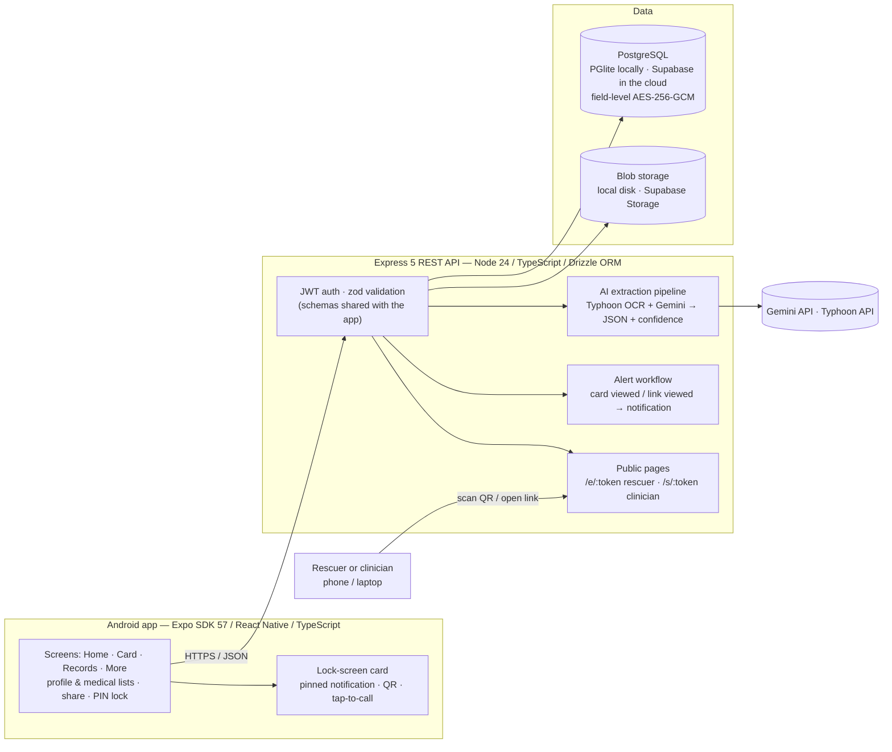

Request flow for one scanned certificate: photo → resized to 1600 px JPEG on the phone → SHA-256 (duplicates rejected with 409) → `POST /records` → `PUT /records/:id/blob` → `POST /records/:id/confirm` → `POST /records/:id/extract` → JSON with a confidence and evidence snippet per field → user edits red fields → `PUT /records/:id` stores encrypted columns.

## Project structure

```
apps/
  api/        Express 5 API: src/auth, src/modules/{profile,records,extract,share,alerts,notifications,consent,public,health},
              src/db (Drizzle schema + migrations), src/crypto, src/storage, test/ (vitest on in-memory PGlite)
  mobile/     Expo app: src/app (Expo Router screens), src/components, src/lib (api, notifications, phone, pin, format),
              src/store (session), src/theme (tokens, Paper themes)
packages/
  shared/     Contract used by both apps: zod schemas, buildCardPayload(), Buddhist-era dates, TH/EN strings
docs/         PLAN-full, research notes, decisions log, worklog, test plan, handout, screenshots
.github/      CI: api-ci (shared + API tests), mobile-ci (strict typecheck)
```

## Installation steps
Prerequisites: Node 24 (`.nvmrc`), JDK 17 or 21, Android Studio with SDK Platform 36, `ANDROID_HOME` set. Windows first; macOS/Linux equivalents in each step.

```bash
git clone https://github.com/enchantedglycerin/MediFirstCard C:/mfc && cd C:/mfc   # short path avoids the Windows 260-char build failure
npm install
cp apps/api/.env.example apps/api/.env   # set FIELD_ENC_KEY and JWT_SECRET (instructions in the file)
```

## Install the app on a phone (no build tools needed)
Download the signed APK from the latest [GitHub release](https://github.com/enchantedglycerin/MediFirstCard/releases) and install it (`adb install -r MediFirstCard-v1.0.0.apk`, or open the file on the phone and allow the install). Then open **More → Developer → Server URL** and enter the address of the API (the laptop's Wi-Fi IPv4 for a classroom demo, e.g. `http://192.168.1.20:3000`, or the Render URL once deployed).

Release builds are signed with the team's own keystore (certificate `CN=MediFirstCard, OU=Course 040333215`, SHA-256 `07:41:48:86:B0:D6:CE:50:F7:79:51:D6:4B:C4:93:DF:1D:53:BD:A4:9E:D8:E9:50:F9:35:21:93:FF:22:2C:9D`). The keystore and its passwords live in `apps/mobile/credentials/` on the lead developer's machine and are **never committed**; the Expo config plugin `apps/mobile/plugins/withReleaseSigning.js` wires them into Gradle at prebuild and falls back to debug signing when the folder is absent (CI, other machines). Verify a downloaded APK with `apksigner verify --print-certs`.

## How to run the app
**No cloud accounts, no Docker (dev / grader):** the API uses PGlite (embedded Postgres) when `DATABASE_URL` is unset, local-disk storage and the mock extractor.

```bash
npm run api:dev                          # Express on :3000; PGlite auto-migrates to apps/api/.data/pg
cd apps/mobile && npx expo run:android   # ALWAYS from apps/mobile (see docs/decisions.md); builds + installs the debug app
```
The debug app loads JavaScript from Metro. If it stays on the splash screen, Metro is not reachable: run `npx expo start` in `apps/mobile` from a normal terminal (not a CI shell) and, for a USB phone, `adb reverse tcp:8081 tcp:8081 && adb reverse tcp:8082 tcp:8081 && adb reverse tcp:3000 tcp:3000`. Set the API address under **More → Developer → Server URL** if the phone cannot use `localhost`.

**Cloud (Supabase + Gemini/Typhoon + Render):** fill Part B of `apps/api/.env` (Supabase database URL, service-role key, Gemini and Typhoon keys), then deploy the API with the Render Blueprint in `render.yaml` — step-by-step in [docs/deploy-render.md](docs/deploy-render.md). Release builds default to `https://medifirstcard-api.onrender.com`; any other server can be set under More → Developer → Server URL. Optional: `docker compose up -d db` for a local real Postgres.

Verify the backend (no Docker, no accounts needed):
```bash
npm run shared:test      # 13 tests (card builder incl. tap-to-call phone, dates, validation)
npm run api:test         # 63 tests (auth, profile, card, records, extraction, Gemini/Typhoon/Supabase adapters offline, public pages incl. tel: links, share, consent)
npm run mobile:typecheck # strict TypeScript over the whole app
```

## API / database / AI / sensor configuration
Env reference: [apps/api/.env.example](apps/api/.env.example). Extraction providers: `EXTRACT_PROVIDER=gemini|mock` — `gemini` is live once `GEMINI_API_KEY` is set (Google AI Studio; `GEMINI_MODEL` defaults to `gemini-2.5-flash-lite`). With no key, or if Gemini fails after retries, the API serves the mock extraction labelled `source: "mock"` with a warning code, so the demo never breaks. `OCR_PROVIDER=typhoon|none` optionally adds a Typhoon OCR pass first (`TYPHOON_API_KEY` from playground.opentyphoon.ai) whose Markdown is given to Gemini as extra context; if OCR fails the extraction continues from the image alone (`ocr_unavailable`). Both free tiers may use inputs to improve their models, so only synthetic documents go through them. Storage: `STORAGE_PROVIDER=local|supabase` — `supabase` uses Supabase Storage over REST and needs `SUPABASE_URL`, `SUPABASE_SERVICE_ROLE_KEY` and a private `SUPABASE_BUCKET`. Database: `DATABASE_URL` unset → PGlite on disk. **Device / sensors:** camera and photo picker (document capture), dialer intent (tap-to-call), notification channel with lock-screen visibility, fingerprint/face via `expo-local-authentication`; no IoT sensor. **What is encrypted:** every health-content text column (names, allergy substances/reactions, conditions, medications, contact names and phones, record titles/facility/doctor/licence, notes); enums, dates, blood group and IDs stay plain for filtering.

## Data management, state and error handling
- **Structured schema with timestamps and metadata** — every table has `created_at`/`updated_at`; records carry kind, status (`pending → uploaded → extracted → reviewed`), MIME, size, SHA-256 and validity; share links keep expiry, view count, revocation and an access log.
- **Validation in one place** — zod schemas in `packages/shared` are used by the API (request bodies) and the app (forms): Thai phone `0XXXXXXXXX`, Thai national ID checksum, ISO dates, enums, size limits; duplicate documents are rejected by hash.
- **App state** — TanStack Query caches server data and invalidates after every mutation; a zustand store holds the session (tokens in SecureStore); the PIN never leaves the device (salted, iterated SHA-256).
- **History** — records list with dates and status, notification feed, per-link access log, consent versions.
- **Testing** — 13 shared unit tests and 63 API tests (integration on an in-memory PGlite database, plus the Gemini/Typhoon/Supabase adapters against a fake `fetch`) run in CI; the app is typechecked in strict mode in CI; every flow was exercised on a physical phone (see worklog).
- **Error handling** — the API returns coded JSON errors (`DUPLICATE_RECORD`, `NO_PROFILE`, `UNAUTHENTICATED`, …) through one error middleware; the app maps them to Thai/English messages, retries expired tokens once with a single-flight refresh, and shows "cannot reach the server" instead of crashing when the API is down.

## Screenshots
Taken on a Samsung phone (Android 13). All 18 are in [docs/screenshots/](docs/screenshots/).

| Live Gemini + Typhoon review (cloud) | Record detail, image from Supabase Storage | Pinned lock-screen notification | Dashboard with completeness |
|---|---|---|---|
| 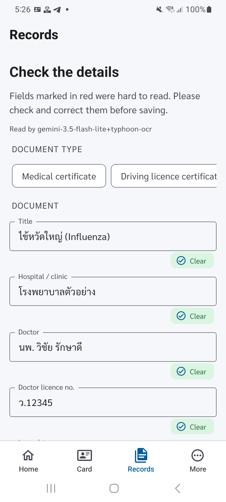 | 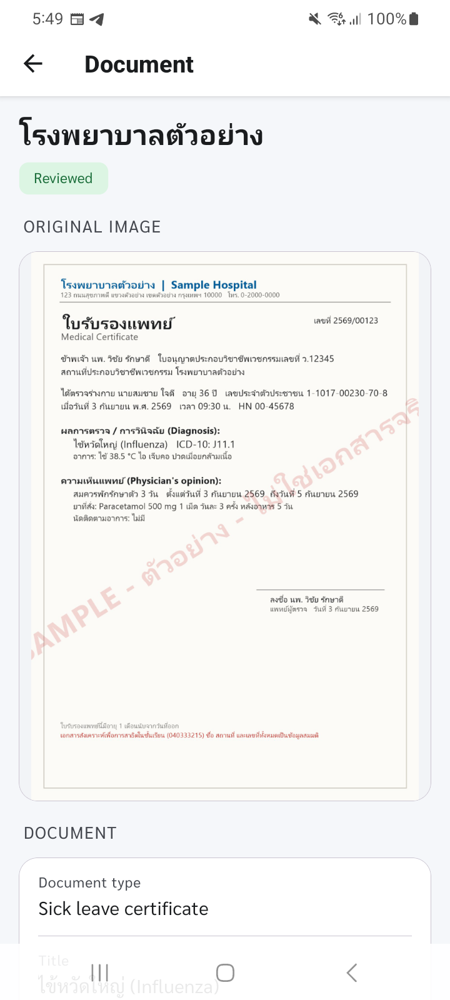 | 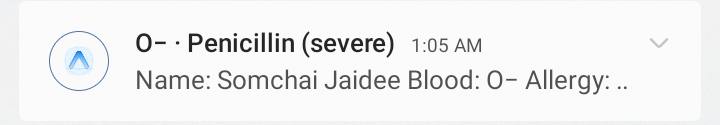 | 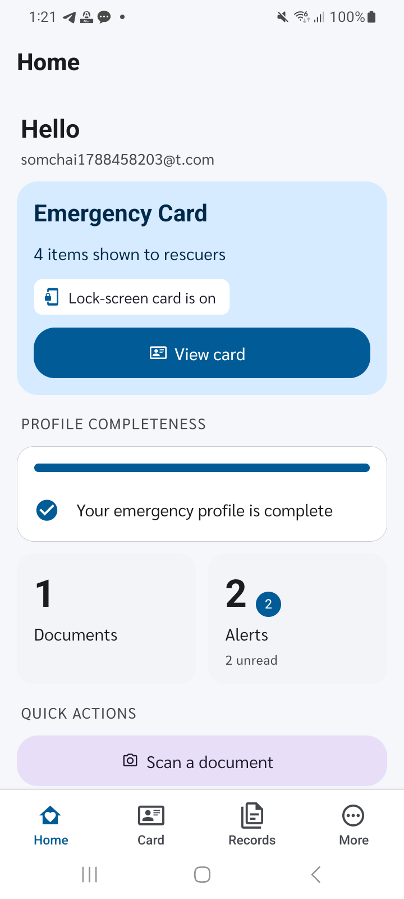 |

| Emergency card (Call 1669, contact Call) | Tap-to-call opens the dialer | Clinician share link | PIN lock on launch |
|---|---|---|---|
| 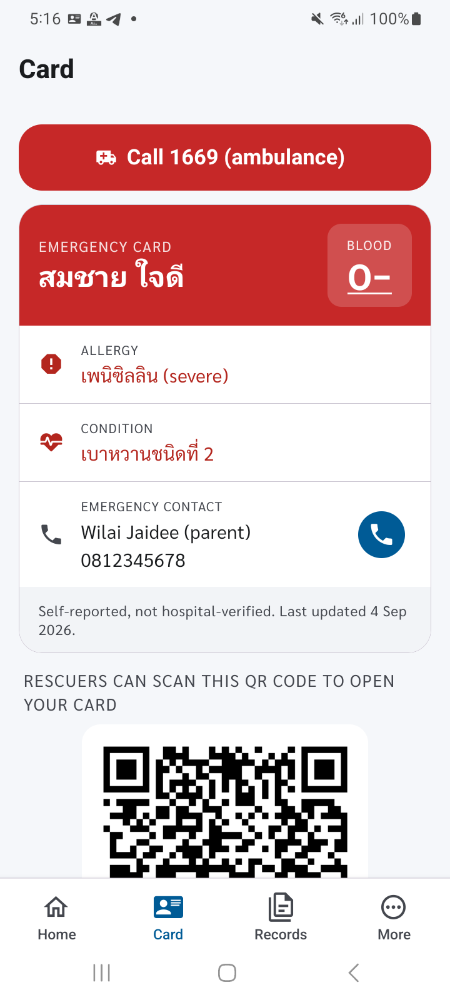 | 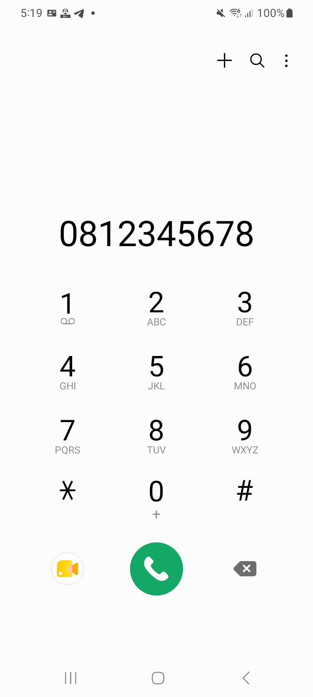 | 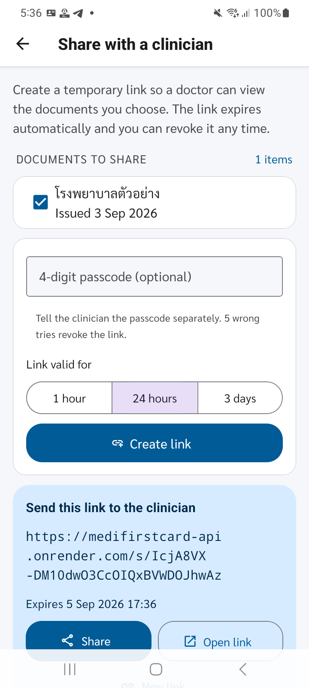 | 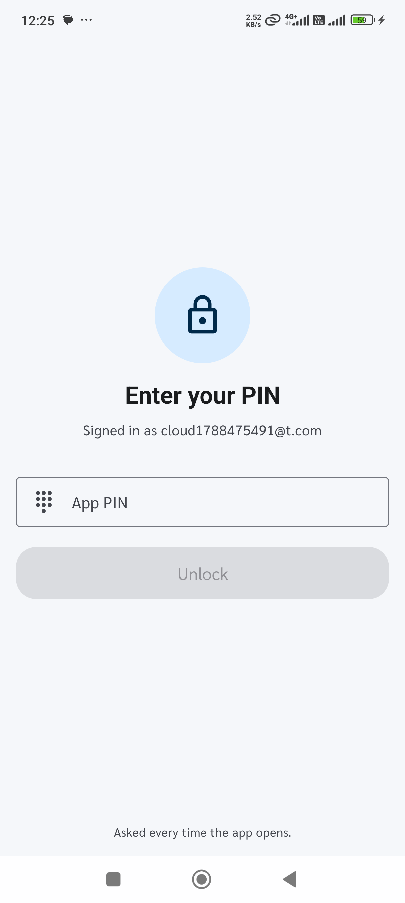 |

| PDPA consent | Emergency contacts | Card in Thai | Alerts and language |
|---|---|---|---|
| 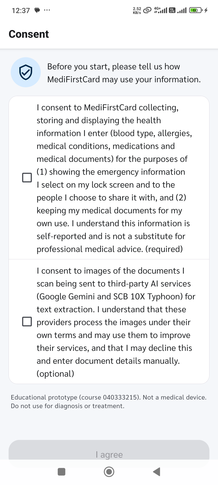 | 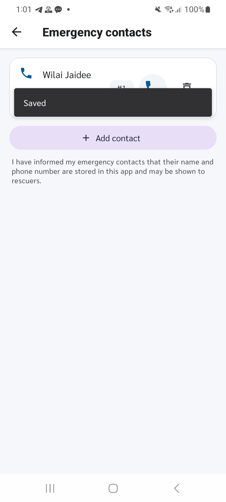 | 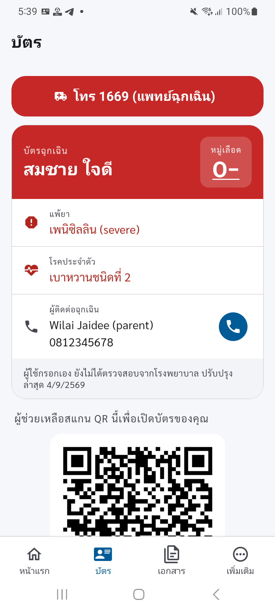 | 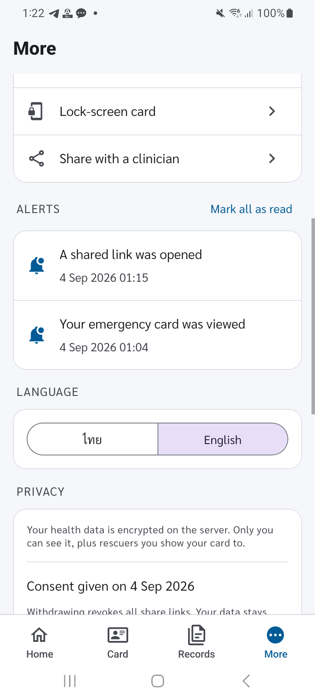 |

## Demo video links
- App introduction video (≤ 3 min): _to be added before 7 Oct 2026_
- Live demo recording: _to be added after the demo on 7 Oct 2026_

## Limitations
Lock-screen card is a pinned notification; how much of it shows on the lock screen depends on the phone's notification privacy setting. The Android 16 lock-screen widget hub is not targeted. iOS designed but not built. AI is assistive; the shipped provider is a deterministic mock until Gemini/Typhoon keys are added, and Thai handwriting is unverified; document images would go to Google Gemini and SCB 10X Typhoon (free tiers that may use inputs), so the demo uses synthetic documents only. Alert email is a stub. Single server encryption key; PIN lock-out signs the user out after 5 failures; not PDPA-audited; no guardian consent for minors; not connected to Mor Prom / Health Link; no offline cache; free-tier server sleeps. Cloud deployment (Supabase + Render) is scripted but not yet provisioned.

## Future development directions
Verifying the Gemini + Typhoon extraction and Supabase Storage adapters against the real free tiers (wired and tested offline; no keys provisioned yet), Render deploy, iOS WidgetKit, edge-detecting scanner, vaccination module, offline cache, push notifications, FHIR export to hospitals, NFC card.

## A statement on responsible use
MediFirstCard is a student educational prototype, not a medical device, and must not be used for diagnosis or treatment. Health data is sensitive personal data under the Thai PDPA: the app asks for explicit consent, states purposes and retention, names the AI providers, and lets the user withdraw consent and delete all data. Anything shown on the lock screen is readable by anyone holding the phone, so the user chooses each field and is warned before enabling it. Medical staff must confirm blood group, allergies and medications by standard procedures.
