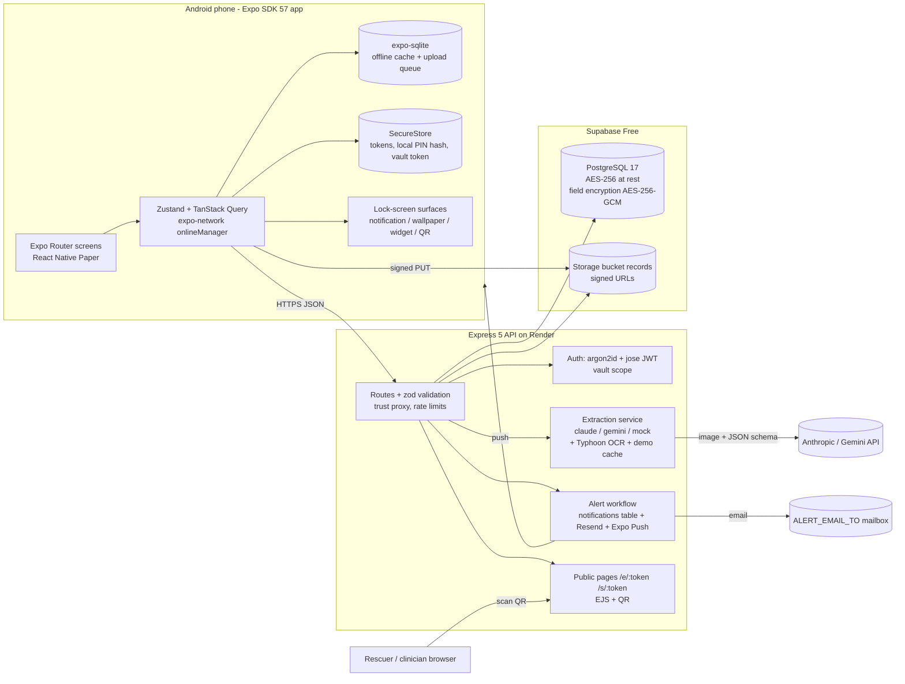

# MediFirstCard — Full Implementation Plan (reference, v1.1.1; superseded by PLAN.md v2.0 trimmed scope)

Version 1.1.1 · Written 2026-09-03 by Claude Fable 5.1 (v1.0 reviewed by four adversarial critics and a verification pass; 60+ fixes folded in) · Executor: Claude Opus 4.8 + the 3-student team
Evidence base: `docs/research/*.md` (7 research reports; every package version checked on npm on 2026-09-03; every claim tagged confirmed / from-digest / unverified). When this plan and a research file disagree, this plan wins. When this plan is silent, the research file is the reference. Deviations go in `docs/decisions.md`.

---

## 0. How to use this plan (read first, Opus)

**What you are building.** MediFirstCard: an Android-first React Native (Expo SDK 57) app with three pillars from the proposal — (1) an emergency health card shown on the phone's lock screen with user-chosen fields, (2) a PIN-protected archive of scanned medical certificates and records, with AI extraction of certificate fields, and (3) password-protected, encrypted client–server storage (Node/Express + PostgreSQL) — plus QR/link sharing for rescuers and clinicians. Graded university prototype (course 040333215): live demo **Wed 7 Oct 2026**, repository due **Sun 11 Oct 2026 23:59**.

**Ground rules.**
1. Work phase by phase (§12). Phase gates are the on-phone acceptance items; design artefacts and docs never block code.
2. Install native packages only with `npx expo install <pkg>` from `apps/mobile`, so SDK 57 pins are respected. Never `npm i` `react-native-reanimated`, `react-native-gesture-handler`, `@shopify/react-native-skia` or `react-native-svg` directly.
3. Never fake an integration in the demo or in README claims. A clearly labelled `mock` extraction provider and a `local` storage adapter **are required** so tests and key-less local runs work; the API marks mock output with `warnings: ["mock provider"]` and README calls it dev/test only.
4. Every MUST feature has acceptance items in §12. A feature is done only when a student has seen it pass on a physical Android phone.
5. Commits carry student identity (IPAC is graded). Opus never commits under its own name. The owning student (§12.0 table) reviews, commits and pushes from their own GitHub account with the trailer `Co-authored-by: Claude Opus 4.8 <noreply@anthropic.com>`; pair work adds the reviewer as a second `Co-authored-by`. Target ≥25 % of commits per student; check `git shortlog -sn` at every phase gate. README §2 states: "Implementation was AI-assisted (Claude); each member reviewed and committed the code they own."
6. Keep the educational-prototype disclaimer visible (onboarding, About, card footer, public pages, PDF, README). Never phrase any output as diagnosis or treatment advice.
7. When something is impossible (package fails to build, free tier changed), apply the fallback in §16, log it in `docs/decisions.md`, continue. Do not stall.
8. Thai is the primary UI and legal language; English secondary. Store dates as ISO 8601 (CE); display Buddhist Era.
9. Ask the team only the questions in §17, once; otherwise proceed with the stated assumption.
10. If an acceptance item stays red for more than one working day: tag the phase anyway, list the item at the top of the next phase, write the blocker in `docs/decisions.md`, tell DEV. Never delete the item.
11. Two work streams may run in parallel (two Opus sessions, two branches: `api/*` and `mobile/*`) once `packages/shared` is frozen at the end of W1. PM verifies the API with curl/Scalar; DEV verifies mobile on the phone.
12. At the end of every phase Opus writes `docs/walkthrough/<module>.md` (purpose, request flow, key files, 5 likely grader questions with answers) and the owning student presents it to the other two in a 30-minute session logged in `docs/worklog.md`. Technical understanding is 7.5 of the 40 points.

**Definition of done.** §15 fully ticked; the app runs from a clean clone using README (both the no-cloud path and the full path); intro video ≤ 3 min plus the full demo recording published; live demo rehearsed four times on the release build; keepalives left running through grading.

---

## 1. Project snapshot

| Item | Value |
|---|---|
| Deliverables left | Video + live demo 7 Oct (peer 10 + instructor 5 pts); GitHub repo + README 11 Oct (20 pts). Proposal (5) already submitted. |
| Team | ปิยนุช นุ่มน้อย (**PM** / System Analyst) · เหม่หลิ๋ง ตัน (**UX**/UI + medical consultant) · ณัฐพัชร์ ทัศนะเมธี (**DEV**, lead full-stack) · Claude Opus 4.8 (**OPUS**, implementation under DEV's direction) |
| Dev machine | Windows 10 Pro 19045, Node 24.15.0, Java 21 present (install JDK 17 and point `JAVA_HOME` at it), adb present, Android SDK present but `ANDROID_HOME` unset. No Xcode → **Android only**; iOS designed and documented, not built. |
| Budget | $0. Every service has a no-card free tier. |
| Proposal promises graders will check | Lock-screen emergency card (widget), records archive with camera scan, password-protected access, Express REST API, PostgreSQL encrypted at rest and in transit, user-chosen lock-screen fields, OCR as optional. |
| Rubric hard rules | RN app that runs; ≥3 screens with navigation; ≥1 input/data source; dashboard screen; healthcare context; GitHub + README; screenshots/video; prototype disclaimer. **≥5 advanced features from ≥3 categories, ≥2 genuine system integrations.** |

Calendar (today Thu 3 Sep): Phase 0 Thu 3–Fri 4 · W1 Sat 5–Wed 9 Sep · W2 Thu 10–Wed 16 · W3 Thu 17–Wed 23 · W4 Thu 24–Wed 30 (**demo-scope freeze Sun 27 Sep, code freeze + Rehearsal 0 Wed 30 Sep**) · W5 Thu 1–Tue 6 Oct (Rehearsal 1 Fri 2, video cut Sat 3, Rehearsals 2–3 Mon 5–Tue 6) · Wed 7 Oct demo · Thu 8–Sun 11 Oct docs.

---

## 2. Locked decisions

### 2.1 Product scope and the "telemedicine" question
The proposal is an emergency-ID + records app; Thai Medical Council notice 54/2563 restricts telemedicine to licensed facilities. MediFirstCard therefore acts as a **telemedicine bridge**, listed under "Additional features" (never as a headline): a clinician share link, a prepare-for-consult summary, a visit log, and a directory of licensed services. Video and README keep the proposal's three pillars as the headline order. Excluded: video/chat, e-prescription, appointment booking, symptom checker or any diagnostic AI.

### 2.2 Official advanced features (declare exactly these six; each is defined only by MUST items)

| # | Feature (README/video wording) | Rubric category | Genuine integration |
|---|---|---|---|
| A1 | Custom Express 5 + TypeScript REST API with JWT auth, hosted on Render | 2 API/Backend | **Yes** |
| A2 | Supabase PostgreSQL + Supabase Storage: structured schema with timestamps and metadata, AES-256-GCM encryption of all health-content text columns, signed-URL uploads, SHA-256 duplicate detection | 1 Data & Storage | **Yes** |
| A3 | AI document extraction: a vision LLM reads a Thai/English medical certificate into structured fields with a per-field confidence score and an evidence snippet (explainability); user reviews before saving | 4 AI/ML | **Yes** |
| A4 | Automated alert workflow: viewing the public emergency card fires a backend event → in-app notification list + email to the configured alert address (+ push when configured) | 2 Automation | **Yes** |
| A5 | PDPA consent screen, role-based views (owner / rescuer public / clinician share), clinically meaningful status labels, elderly-first accessibility | 5 Medical UI/UX | No |
| A6 | Offline-first local storage (expo-sqlite + SecureStore) with upload queue, plus PDF emergency-card export | 1 Data & Storage | No |
| Additional (list if shipped) | Android App Widget with lock-screen hub support (proposal core); "explain this document" chat; expiry reminders; 1669 call script; JSON export (FHIR-lite bundle); telemedicine bridge | — | — |

Coverage: categories 1, 2, 4, 5; four genuine integrations. Do **not** claim Category 3 (Sensor/IoT), Node-RED or n8n. README §8 "Sensors" reads: "Device camera (document capture) and GPS (1669 call script) via OS APIs; no IoT sensor — Category 3 not claimed."

### 2.3 Technology stack (versions verified on npm 2026-09-03)

**Mobile (`apps/mobile`)** — Expo SDK 57 (`expo@57.0.19`, React Native 0.86.3, React 19.2.3, New Architecture mandatory, Hermes V1). Development build (`npx expo run:android`); Expo Go is not used.

| Concern | Package | Notes |
|---|---|---|
| Routing | `expo-router` ~57.0.18 | Import `Stack`/`Tabs` from `expo-router`; never import `@react-navigation/*` in app code (SDK 56+). |
| UI kit | `react-native-paper` 5.15.3 + `react-native-safe-area-context` (pinned) | Material 3; dark theme built in; test TextInput/Modal/Menu on device in W1 (New Arch minor bugs). |
| Icons | `@expo/vector-icons` (bundled; MaterialCommunityIcons) + `healthicons-react-native` 3.5.0 + `react-native-svg` 15.15.4 (pinned) | `@expo/vector-icons` is deprecated since SDK 56 but still bundled and maintained; migrate to `@react-native-vector-icons/*` only if time allows. |
| Fonts | `@expo-google-fonts/sarabun` 0.4.1 + `expo-font` + `expo-splash-screen` | Sarabun (looped Thai) everywhere; weights via family name (`Sarabun_700Bold`), never `fontWeight`. |
| Animation | `lottie-react-native` 7.5.0 | ≤3 animations; respect reduce-motion. |
| State | `@tanstack/react-query` 5.102.8 · `zustand` 5.0.15 | Query for API data (with `onlineManager` wired to `expo-network`); Zustand for session, locale, lock-screen settings. |
| Forms | `react-hook-form` 7.87.0 + `zod` 4.5.4 + `@hookform/resolvers` 5.9.1 | Zod schemas live in `packages/shared`. |
| Local DB | `expo-sqlite` ~57.0.2 (raw SQL, in-code migrations; `expo-sqlite/kv-store` for key-value) | SQLCipher **off** for v1 (encryption is server-side). |
| Secure storage / biometrics / crypto | `expo-secure-store` ~57.0.3 · `expo-local-authentication` ~57.0.2 · `expo-crypto` (version from `npx expo install`) | Tokens, local PIN hash, vault token; SHA-256 for duplicate detection. |
| Network state | `expo-network` ~57.0.1 | Offline banner, queue flush, TanStack `onlineManager`. |
| Images | `expo-image-picker` ~57.0.15 (camera + gallery) · `expo-image-manipulator` ~57.0.15 | Resize 1600 px long edge, JPEG 0.85 before upload. No `expo-camera` (no in-app QR scanning feature). |
| Files / PDF / share / gallery | `expo-file-system` ~57.0.6 (class API) · `expo-print` ~57.0.1 · `expo-sharing` ~57.0.17 · `expo-media-library` ~57.0.4 (`Asset.create`, not `createAssetAsync`) | |
| Lock screen | `expo-notifications` ~57.0.16 · `react-native-view-shot` 5.1.0 (pinned) · `react-native-android-widget` 0.22.1 · `react-native-qrcode-svg` 6.3.22 | §9. |
| Location / calls | `expo-location` (version from `npx expo install`) · `expo-linking` | 1669 script GPS; `tel:` / `sms:`. |
| i18n / dates | `i18next` 26.4.1 · `react-i18next` 17.0.13 · `expo-localization` ~57.0.1 · `dayjs` 1.11.23 (+ `buddhistEra`, `locale/th`) | Never `Intl` with the Buddhist calendar on Hermes. |
| Validation helpers | `thai-id-validator` 1.1.7 · `thai-data` 3.0.2 (optional) | |
| Tests | `jest-expo` ~57.0.5 · `@testing-library/react-native` 14.0.1 · Maestro CLI (optional) | Install `test-renderer` ^1.0.0 (not `react-test-renderer`) if jest-expo asks. |

Do not use: Notifee (archived), `expo-barcode-scanner`, `expo-av`, `react-test-renderer`, `react-native-document-scanner-plugin`, unpinned Reanimated 4.6 / Gesture Handler 3 / Skia 2.11, `@react-navigation/*` imports, Expo Go.

**API (`apps/api`)** — Node 24 LTS (`.nvmrc` = 24; `engines: ">=22"`; Render `NODE_VERSION=24`), TypeScript 5.9, ESM.

| Concern | Package |
|---|---|
| HTTP | `express` 5.2.1 · `@types/express` 5.0.6 · `helmet` 8.3.0 · `cors` 2.8.6 · `express-rate-limit` 8.7.0 |
| Validation / logging | `zod` 4.5.4 (shared) · `pino` 10.3.1 + `pino-http` |
| DB | `drizzle-orm` 0.45.2 · `drizzle-kit` 0.31.10 · `pg` 8.23.0 (not Prisma: `latest` is an RC) |
| Auth / crypto | `argon2` 0.45.1 (Argon2id m=19456,t=2,p=1) · `jose` 6.2.10 (HS256; access 15 min; refresh 30 d rotated, hashed) · Node `crypto` AES-256-GCM |
| Uploads / images | `multer` 2.3.0 (profile-photo and demo-document paths) · `file-type` 22.0.2 · `sharp` 0.35.4 |
| Storage / mail / push | `@supabase/supabase-js` 2.114.0 · `resend` (pin with `--save-exact` on install day) · `expo-server-sdk` 7.2.0 |
| AI | `@anthropic-ai/sdk` 0.123.0 · `@google/genai` 2.21.0 |
| Public pages / QR | `ejs` 3.1.10 · `qrcode` 1.5.4 |
| Docs / tests / tooling | `zod-openapi` 6.0.2 + `@scalar/express-api-reference` 0.10.17 (docs window only) · `vitest` 4.1.11 · `supertest` 7.2.2 · `tsx` 4.23.13 · `esbuild` 0.28.2 |

**Services (all $0, no card)**

| Service | Role | Limit that matters | Mitigation |
|---|---|---|---|
| Supabase Free (Singapore) | PostgreSQL 17 + private Storage bucket `records` | 500 MB DB, 1 GB files, 50 MB/file; **pauses after 7 idle days**. `DATABASE_URL` must be the **Session pooler** URI (port 5432, host `aws-0-<region>.pooler.supabase.com`, user `postgres.<ref>`) — the direct `db.<ref>.supabase.co` URI is IPv6-only and unreachable from Render and GitHub Actions. | UptimeRobot 5-min ping on `/health/db` + GitHub Actions cron every 6 h, kept running through grading |
| Render Free Web Service | Express API at `https://medifirstcard-api.onrender.com` | Sleeps after 15 min idle (~1 min wake); 750 h/month; reverse proxy (needs `trust proxy`) | UptimeRobot; pre-warm; never use Render's free Postgres |
| UptimeRobot Free | Keepalive | 50 monitors | — |
| GitHub public repo | Code, Actions (free minutes), Releases (APK) | — | — |
| Expo (free) | EAS Build fallback (15 Android/month); Expo Push (free) | Low-priority queue | Build locally |
| Resend Free | Alert emails | 3,000/month; **without a verified domain, mail is delivered only to the Resend account owner's address** (verify in Phase 0) | `ALERT_EMAIL_TO` = that address (PM); README limitation |
| Anthropic API | Extraction + explanation for real documents (`claude-opus-5` default) | Small free credits; cost per document measured in spike S-D (research figures ~$0.007 Haiku, ~$0.014 Sonnet; Opus 5 several times higher) | Keep ≥US$5 credit through grading; mock + cache fallbacks |
| Gemini API free tier | Extraction for **synthetic documents only** (free tier trains on inputs; terms forbid personal data) | Limits visible only in AI Studio | Never default; requires `ALLOW_DEMO_PROVIDER=1` |
| Typhoon OCR API | Thai text layer for agreement scoring (likely tier) | 20 req/min; collects usage data | Off in strict mode |
| cloudflared quick tunnel / hotspot | Demo fallback for API calls | Random URL | In-app Server URL setting (F31) |

### 2.4 Lock-screen strategy (proposal headline)
One privacy object `lockScreenFields` (§9) drives a ladder of surfaces:
- **Tier 1 — guaranteed (W2):** sticky public-visibility notification card (`expo-notifications`; requires the Android 13+ permission prompt; text is visible without unlocking when the phone's lock-screen setting shows notification content, collapsed to 1–2 lines; tapping requires unlock), a **wallpaper card** rendered with `react-native-view-shot` and saved to the gallery with guided "set as lock screen", and a **QR to the public emergency page** `/e/<token>` (any browser). Printable PDF card in W3.
- **Tier 2 — likely (W1 spike, JS in W2):** Android home-screen App Widget via `react-native-android-widget`; on Pixel phones with Android 16 QPR2+ (and the API 36.1 emulator image) the same widget is placeable on the lock-screen widget hub without extra code. If spike S-A passes, the widget module is part of the frozen native shell and the renderer is JS-only work.
- **Tier 3 — stretch/documented:** Quick Settings tile; foreground-service multi-line card (`react-native-notify-kit`); iOS `expo-widgets` accessory widget (documented only; needs Apple Developer $99 + iPhone).
Honest wording everywhere: "Lock-screen widget: Pixel Android 16 QPR2+ (and emulator); all other Android phones get the lock-screen notification card and wallpaper card; visibility depends on the phone's lock-screen notification setting."

### 2.5 AI strategy
On-device ML Kit cannot read Thai and tesseract Thai is unusable, so extraction is server-side with a vision LLM returning JSON: providers `claude` (default, `claude-opus-5`; inputs not used for training), `gemini` (`gemini-2.5-flash`; synthetic docs only), `mock` (fixtures; tests and key-less runs), plus a `demo_cache` fallback keyed by image SHA-256. Per-field `{value, confidence, evidence}` gives the confidence score and explainability in one call. §10.

### 2.6 Visual identity
Clinical blue primary `#005B96`; red reserved for allergies/urgent (`#B3261E`); status triad normal/caution/urgent always colour + icon + text; Sarabun; body ≥18 sp, card values 26 sp bold, touch targets ≥48 dp; light default, dark supported; unDraw illustrations; one Lottie heartbeat on splash. Tokens: `docs/research/research-ui-kit.md` §6.3 → `apps/mobile/src/theme/tokens.ts` verbatim.

---

## 3. Feature list

Priority: **MUST** ships by the code freeze (Wed 30 Sep); **SHOULD** if the preceding phase ends on time; **COULD** only after all MUST/SHOULD are demo-ready; **OUT** goes to Future development. `INT` = genuine integration.

**Demo core** (must be on the release build by Sun 27 Sep, demo-scope freeze): F01–F04, F05 (gallery save), F06, F11, F12, F13, F15, F16, F17 (PDF card), F21 (plain 24 h link + revoke), F22, F23 (in-app + email), F26, F27, F28, F29, F30, F31, and F07 if spike S-A passed.

### 3.1 Emergency card & lock screen
| ID | Feature | Pri | Cat | Demo moment |
|---|---|---|---|---|
| F01 | Emergency profile: name (TH/EN), age from DOB, sex, photo, blood group ABO+Rh, drug allergies (drug, reaction, severity, source), chronic conditions (Thai pick-list + free text), critical medications, flags (anticoagulant, insulin, pacemaker, dialysis, pregnancy), emergency contacts (2, relationship, "I have informed them" checkbox), insurance scheme, preferred language, explicit "no known drug allergies" state | MUST | 1, 5 | Add penicillin allergy, severity "severe" → red chip on card |
| F02 | Emergency Card (owner view) and Rescuer view: large type, red-flag ordering (allergies → conditions → meds → contacts), tap-to-call, "self-reported, last updated" footer, TH+EN | MUST | 5 | Show card; switch language |
| F03 | Lock-screen field picker with live preview + exposure warning | MUST | 5 | Toggle "medications" off → preview and notification update within 1 s |
| F04 | Tier 1 notification card (sticky, public, permission requested) with master switch | MUST | 5 | Lock the phone → blood group + top allergy readable on the first line |
| F05 | Wallpaper card: 1080×2400 PNG saved to gallery + guided "set as lock screen" (MUST); direct set via `react-native-nitro-wallpaper` only if spike S-C passes (SHOULD) | MUST/SHOULD | 5 | Lock screen shows the card image |
| F06 | Emergency QR + public page `/e/<token>` (rescuer view), one active emergency link per user, rotate | MUST | 2 INT | Second phone scans the wallpaper QR → page loads from Render |
| F07 | Android App Widget (home screen; Pixel A16 QPR2 / AVD lock-screen hub) | SHOULD (MUST if S-A passed) | 5 / OS | Add widget; on the AVD, swipe to the lock-screen widget page |
| F08 | "Call 1669" button + call-script screen (age/sex, conscious/breathing toggles, GPS coordinates, callback number, TH/EN read-aloud) | SHOULD | 5 | Dialer opens with 1669 prefilled (do not call) |
| F09 | SOS share: prefilled SMS/LINE share sheet with location link | COULD | 2 | — |
| F10 | Quick Settings tile / foreground-service card / iOS widget | OUT | — | Documented |

### 3.2 Records & certificates archive
| ID | Feature | Pri | Cat | Demo moment |
|---|---|---|---|---|
| F11 | Capture: camera/gallery → compress → client SHA-256 → `POST /records` (409 on duplicate) → signed PUT to Storage → `confirm` (server normalises image, blur check) → record row with type, hospital, doctor, dates (BE display), tags, notes | MUST | 1, 2 INT | Photograph a synthetic certificate; encrypted row appears in Supabase on the projector |
| F12 | Timeline: list by date, filter by type/hospital, search, detail with image, "valid until" badge, delete (row + object) | MUST | 1 | Filter "certificate"; delete a test record |
| F13 | AI extraction (A3): `POST /records/:id/extract` → review screen with confidence chips (green ≥0.85 / amber / red <0.6), evidence snippet per field, inline edit, save; error states blurry / not medical / low confidence / provider down / cached result | MUST | 4 INT | Extract the smudged synthetic certificate → red licence-number field corrected |
| F14 | "Explain this document" chat in plain Thai (from extraction JSON, never diagnosis) | SHOULD | 4 | Ask "ต้องพักกี่วัน" |
| F15 | Offline-first: card + records metadata cached in SQLite; local PIN unlock; pending-upload queue; offline banner via `expo-network`; auto-flush on reconnect | MUST | 1 | Airplane mode → PIN unlock → records open; add record → queued → back online → synced within 10 s |
| F16 | Validation on both sides: missing values, ranges, blood group enum, phone format, Thai ID checksum, future dates, duplicate document (SHA-256) | MUST | 1 | Empty allergy form, future DOB, invalid Thai ID → field errors; re-upload same photo → 409 |
| F17 | Export: PDF emergency card with QR (wallet size; W3) + PDF records summary with limitations text; JSON export as FHIR-lite Bundle | MUST (PDF card) / SHOULD (rest) | 1, 5 | Share sheet opens with the PDF |
| F18a | Reminders job (`POST /internal/reminders` from GitHub Actions cron) → in-app notifications for certificate expiry / follow-up | SHOULD | 2 | Notification list shows the reminder |
| F18b | Local/push reminder delivery | SHOULD | 2 | — |
| F19 | Vaccination entries; drug-allergy card digitisation with assessment field | COULD | 1 | — |
| F20 | Edge-detecting scanner, vitals log, sensor stream, image classification | OUT | — | Future work |

### 3.3 Sharing, alerts, telemedicine bridge
| ID | Feature | Pri | Cat | Demo moment |
|---|---|---|---|---|
| F21 | Clinician share link `/s/<token>`: chosen records + summary, 24 h expiry, revoke (MUST); optional 4-digit passcode + max views (SHOULD) | MUST/SHOULD | 2 INT, 5 | Open on laptop → clinician view; revoke → "expired" |
| F22 | Access log + Notifications screen ("who viewed my card", alerts) | MUST | 1, 5 | Shows the scan from F06 with time and outcome |
| F23 | Alert workflow (A4): `/e/:token` or `/s/:token` HTML/JSON view → `card.viewed` event → `notifications` row (MUST) → email via Resend to `ALERT_EMAIL_TO` (MUST) → Expo push (SHOULD) | MUST | 2 INT | Notifications screen updates; API log shows `alert.email sent`; mailbox on projector (bonus) |
| F24 | Prepare-for-consult summary (IPS-lite) + visit log with next steps | SHOULD | 1, 5 | — |
| F25 | Telemedicine directory (MorDee, Doctor Anywhere TH, Samitivej Virtual Hospital, Ooca, หมอพร้อม) with "external licensed service" disclaimer | COULD | 5 | — |

### 3.4 Security, privacy, platform
| ID | Feature | Pri | Cat | Demo moment |
|---|---|---|---|---|
| F26 | Account: email + password (argon2id), JWT access/refresh with rotation, logout everywhere. Password reset: OUT (documented) | MUST | 2 | — |
| F27 | PIN gate (6 digits, local + server, §11), biometric unlock, auto-lock 2 min, lock-out after 5 failures (local + server) | MUST | 5 | Wrong PIN ×5 on the second demo account → lock-out message |
| F28 | PDPA consent screen (separate explicit checkbox; purposes 1–3 incl. AI provider; retention; withdraw) stored with version + timestamp; privacy notice TH/EN at `/privacy` and in-app; account deletion | MUST | 5, 1 | First launch; `consents` row visible |
| F29 | AES-256-GCM encryption of every health-content text column (§5), TLS everywhere, secrets only in env | MUST | 1, 2 | `substance_enc` shows base64 in Supabase |
| F30 | Home dashboard: card completeness %, allergy/condition/med counts, records by type, last sync, pending uploads, next expiry, next steps | MUST | rubric | Landing screen |
| F31 | Settings: language, large text, dark mode, **Server URL override** (kv key `apiBaseUrl`), AI extraction on/off, About (disclaimer, licences) | MUST | 5 | Set Server URL to the laptop → next request hits the laptop log |
| F32 | Multi-profile, guardian consent for minors, Mor Prom/Health Link, ThaID | OUT | — | Limitations |

---

## 4. Architecture



**Repository layout (npm workspaces, single root lockfile).** Create the git repository at the short path `C:\mfc` (move the contents of `C:\workspace\MediFirstCard` there, or clone there). No junction: Node resolves junctions to the long real path, so the 260-character problem would return. Always build from `C:\mfc\apps\mobile`.
```
MediFirstCard/
  package.json            {"private":true,"workspaces":["apps/*","packages/*"]}   .nvmrc = 24
  README.md  PLAN.md  LICENSE  CONTRIBUTORS.md  docker-compose.yml  render.yaml
  .github/workflows/api-ci.yml  mobile-ci.yml
  docs/  architecture.md  decisions.md  worklog.md  demo-script.md  qa-sheet.md  walkthrough/  screenshots/  research/
  packages/shared/        package.json {"name":"@mfc/shared","private":true,"type":"module","main":"./src/index.ts","types":"./src/index.ts"}
    src/  schemas/ (zod: profile, allergy, condition, medication, contact, record, extraction, shareLink)  i18n/{th,en}.json  card/buildCardPayload.ts  dates/  index.ts
  apps/mobile/            Expo app (§7); depends on "@mfc/shared": "*"; Expo SDK 57 auto-configures Metro for workspaces — add no watchFolders/nodeModulesPaths
  apps/api/               Express API; depends on "@mfc/shared": "*"
    package.json  tsconfig.json  drizzle.config.ts  .env.example  Dockerfile
    drizzle/              committed SQL migrations
    src/
      server.ts           app.listen(PORT, '0.0.0.0')
      app.ts              express(), app.set('trust proxy', TRUST_PROXY), helmet (CSP override on /e,/s), cors allowlist, pino-http, json({limit:'1mb'}), routes, error handler
      config/env.ts       zod-validated env (§6.1); server refuses to start listing missing names
      db/index.ts  db/schema.ts  db/seed.ts  db/encryptedFields.ts (list of columns to encrypt)
      crypto/fieldEncryption.ts   AES-256-GCM (research-backend §7)
      auth/password.ts  auth/pin.ts  auth/tokens.ts  auth/middleware.ts (requireAuth, requireVault)
      middleware/validate.ts  rateLimit.ts  errorHandler.ts
      modules/auth  profile  records  extract (providers/claude.ts gemini.ts mock.ts typhoon.ts, pipeline.ts, confidence.ts, demoCache.ts)  share  public  alerts  notifications  export  consent  health  internal
      storage/  supabase.ts  local.ts  (STORAGE_PROVIDER)
      views/emergency.ejs  clinician.ejs  privacy.ejs
    test/  *.test.ts (vitest + supertest)
```
API build: `esbuild src/server.ts --bundle --platform=node --target=node22 --format=esm --outfile=dist/server.mjs --packages=external --alias:@mfc/shared=../../packages/shared/src/index.ts` (the alias inlines the workspace source; if it does not bundle, add `tsc -p packages/shared` as a prebuild and point `main` at `dist`). `tsx` and `vitest` resolve the workspace symlink natively. Render: Root Directory blank; Build `npm ci --include=dev && npm run build -w apps/api && npm run db:migrate -w apps/api` (drizzle-kit is a devDependency); Start `npm start -w apps/api`; Health Check Path `/health`; `NODE_VERSION=24`. CI: `cache-dependency-path: package-lock.json`, `npm ci` at root, then `npm run lint -w apps/api && npm run db:migrate -w apps/api && npm test -w apps/api`, service image `postgres:17-alpine`.

---

## 5. Data model (PostgreSQL via Drizzle; ★ mirrored in mobile SQLite)

| Table | Key columns (all tables: `id uuid pk`, `created_at`, `updated_at`) |
|---|---|
| users | email unique, password_hash, pin_hash, pin_failed_count, pin_locked_until, locale, consent_version, consented_at |
| emergency_profiles ★ | user_id fk unique, first_name_th_enc, last_name_th_enc, name_en_enc, dob date, sex enum, photo_path, blood_abo enum(A,B,AB,O,unknown), blood_rh enum(pos,neg,unknown), no_known_drug_allergy bool, flags jsonb, insurance_scheme enum, preferred_language, notes_enc, lock_screen_fields jsonb, last_reviewed_at |
| allergies ★ | user_id, substance_en_enc, substance_th_enc, category enum(medication,food,environment), reaction_enc, severity enum(mild,moderate,severe), source enum(self,hospital_card), verification enum(unconfirmed,confirmed), noted_at |
| conditions ★ | user_id, code (ICD-10, plain), label_th_enc, label_en_enc, status enum(active,resolved), onset_year, critical bool |
| medications ★ | user_id, name_enc, strength_enc, dose_enc, frequency_th_enc, critical bool, status enum(active,stopped) |
| emergency_contacts ★ | user_id, name_enc, relationship, phone_enc, informed_consent bool, priority int |
| medical_records ★ | user_id, kind enum(certificate_general, certificate_driving, certificate_5disease, sick_leave, prescription, lab, vaccine, allergy_card, discharge, receipt, other), status enum(pending, uploaded, extracted, reviewed), title_enc, facility_enc, doctor_name_enc, doctor_license_no_enc, issued_at date, valid_until date, storage_path, mime, size_bytes, sha256 (unique per user), notes_enc; mobile-only: sync_status, local_uri |
| extractions | record_id fk not null, provider, model, source enum(live,cached,mock), raw_ocr_text_enc, extraction_json_enc, field_meta jsonb, image_quality, latency_ms, tokens_in, tokens_out, reviewed_at |
| share_links | user_id, token_hash unique, scope enum(emergency,records), record_ids uuid[], expires_at (null for emergency), revoked_at, max_views int, view_count int, passcode_hash, failed_passcodes int |
| share_access_log | share_link_id, accessed_at, ip inet, user_agent, outcome enum(ok,expired,revoked,not_found,bad_passcode) |
| consents | user_id, version, purposes jsonb, granted bool, at |
| refresh_tokens | user_id, token_hash, expires_at, revoked_at, replaced_by |
| push_tokens | user_id, expo_token unique, platform |
| notifications | user_id, kind enum(card_viewed, share_viewed, share_revoked, expiry, follow_up), payload jsonb, read_at |
| audit_log | user_id, action, entity, entity_id, at, meta jsonb |
| deleted_users | email_hash, deleted_at (30-day tombstone; the only trace after `DELETE /me`) |
| demo_cache | sha256 pk, extraction_json_enc, field_meta jsonb (written on every live extraction success; survives record deletion) |

Rules:
- **What is encrypted:** every `*_enc` column (all health-content text: names, allergy substances and reactions, condition labels, medication fields, contact names/phones, record titles/facility/doctor/licence, notes, raw OCR, extraction JSON) via `crypto/fieldEncryption.ts` with the column list in `db/encryptedFields.ts`. Plain: enums, booleans, ids, dates, timestamps, ICD-10 codes, blood group enums, `lock_screen_fields`, storage paths. The API decrypts for owner and public views; filtering uses plain columns only. README §8 and §13 carry this exact table.
- `lock_screen_fields` = `{name, bloodType, allergies, conditions, medications, contact}` booleans; defaults `{name:true, bloodType:true, allergies:true, conditions:false, medications:false, contact:true}`. For `scope=emergency` links the public renderer filters by this object **at request time** (no copy in `share_links`).
- `kind` ← extraction `document_type` map: `medical_certificate_sick_leave→sick_leave`, `medical_certificate_5_disease→certificate_5disease`, `prescription→prescription`, `medication_label→prescription`, `lab_result→lab`, `receipt→receipt`, `other_medical→other`, `not_medical→` no change (200 with warning; app offers manual entry). `valid_until` default = `issued_at + 1 month` for `certificate_*` and `sick_leave` when the extraction gives no validity.
- `DELETE /me` = hard delete of all rows (cascade) + asynchronous purge of storage objects + one `deleted_users` tombstone; documented in the privacy notice.

---

## 6. API contract

JSON API routes are mounted at **`/api/v1`**. **Unprefixed:** `GET /health`, `GET /health/db`, `GET /openapi.json`, `GET /docs`, `GET /privacy`, `GET /e/:token/qr.png`, `GET /e/:token.json`, `GET /e/:token`, `GET|POST /s/:token`, `POST /internal/reminders`. Errors `{code, message, details?}`. Protected routes need `Authorization: Bearer <access>`; **vault routes** need a vault JWT (`scope=vault`, 5 min) in the same header: `GET /records/:id`, `GET /records/:id/url`, `POST /records/:id/extract`, `PUT /records/:id/extraction`, `POST /records/:id/explain`, `GET /me/export.json`, `DELETE /me`.

| Method & path | Purpose | Notes |
|---|---|---|
| POST /auth/register · /auth/login · /auth/refresh · /auth/logout | Accounts | login 10/15 min per IP+email |
| POST /auth/pin · POST /auth/pin/verify | Set PIN (argon2id server-side); verify → vault JWT | 5 failures → `pin_locked_until` +15 min (or `DEMO_LOCKOUT_SECONDS` when set) |
| GET /me · GET/PUT /me/profile · POST /me/profile/photo | Session info; emergency profile; photo upload (multipart, 2 MB) | |
| GET/POST/PUT/DELETE /me/allergies · /me/conditions · /me/medications · /me/contacts | Sub-collections | zod from `@mfc/shared` |
| PUT /me/lock-screen-fields · GET /me/emergency-card · POST /me/emergency-card/rotate | Privacy object; card payload `{lines, emergencyUrl, qrPngDataUrl}` (lazily creates the single active emergency link); rotate revokes + recreates | |
| POST /records `{kind?, sha256, sizeBytes, mime}` → 409 `DUPLICATE_RECORD` or `{recordId, signedUploadUrl, token}` · POST /records/:id/confirm · GET /records · GET /records/:id · PUT /records/:id (metadata) · GET /records/:id/url (5-min signed) · DELETE /records/:id | Archive | confirm: server downloads the object once with the service-role key, `sharp.rotate().resize(1600).jpeg({quality:85})` (strips EXIF), Laplacian blur score (< threshold → 422 `IMAGE_BLURRY`), rewrites object, sets status `uploaded` |
| POST /records/:id/extract (no body; header `X-Consent-Version`) → `{extractionId, extraction, fieldMeta, warnings, source}` · PUT /records/:id/extraction (reviewed fields → updates record metadata + kind, sets `reviewed_at`) · POST /records/:id/explain `{question, history?}` → `{answer}` | AI (§10) | 200 with `document_type=not_medical` + warning; `source: live|cached|mock` |
| POST /records/demo-extract (multipart image) | Demo document path; mounted only when `ALLOW_DEMO_PROVIDER=1` | |
| POST /share-links `{scope:'records', recordIds[], ttlHours=24, passcode?, maxViews?}` · GET /share-links · GET /share-links/:id · POST /share-links/:id/revoke · GET /share-links/:id/log | Sharing | |
| GET /e/:token (HTML) · /e/:token.json · /e/:token/qr.png | Public emergency view; rate-limit 30/min per IP+token; HTML and JSON hits log access + fire `card.viewed`; qr.png does neither | register `/qr.png` and `.json` routes **before** `/e/:token`; `?lang=th|en` |
| GET /s/:token (HTML/passcode form) · POST /s/:token (passcode → view) | Clinician view | 5 bad passcodes → auto-revoke + owner notification |
| POST /push-tokens · GET /me/notifications · POST /me/notifications/:id/read | Alerts | |
| GET /me/export.json (FHIR-lite Bundle) | Export | PDF is generated on device |
| POST /me/consent · GET /me/consent · DELETE /me | PDPA | withdrawal revokes all share links |
| POST /internal/reminders | Reminders job (header `X-Internal-Secret`) | called by Actions cron `0 22 * * *` (05:00 Bangkok) |
| GET /health `{ok, version, uptime, ip, extractProvider, storageProvider, privacyMode}` · GET /health/db | Ops | used by Render, UptimeRobot, CI keepalive; the app reads `extractProvider` for the first-scan sheet |

### 6.1 Environment variables (`config/env.ts` zod-validates; `.env.example` in both apps mirrors this table)

| Name | App | Required | Example / default |
|---|---|---|---|
| DATABASE_URL | api | yes | Supabase Session pooler URI (port 5432) |
| PGSSL | api | no | `disable` locally |
| JWT_SECRET · FIELD_ENC_KEY | api | yes | 32+ random bytes; `node -e "console.log(require('crypto').randomBytes(32).toString('base64'))"` |
| SUPABASE_URL · SUPABASE_SERVICE_ROLE_KEY · SUPABASE_BUCKET | api | when STORAGE_PROVIDER=supabase | bucket `records` |
| STORAGE_PROVIDER | api | no | `local` (dev/CI, files under `apps/api/.data`) / `supabase` (Render) |
| EXTRACT_PROVIDER · OCR_PROVIDER · PRIVACY_MODE | api | no | `claude` · `none` · `strict` (defaults). `mock` is allowed in strict mode; `gemini` or `PRIVACY_MODE=demo` refuse to start unless `ALLOW_DEMO_PROVIDER=1`; `PRIVACY_MODE=demo` is never used on stage |
| ANTHROPIC_API_KEY · CLAUDE_MODEL · CLAUDE_EFFORT | api | when provider=claude | `claude-opus-5` · `medium` |
| GEMINI_API_KEY · TYPHOON_API_KEY | api | optional | |
| RESEND_API_KEY · ALERT_EMAIL_TO · RESEND_FROM | api | no (set on Render) | when unset the alert module still inserts the notification row and logs `alert.email skipped (no RESEND_API_KEY)`; `ALERT_EMAIL_TO` = Resend account owner; from `onboarding@resend.dev` |
| PUBLIC_BASE_URL | api | yes | `https://medifirstcard-api.onrender.com` (QRs always use this) |
| CORS_ORIGINS · TRUST_PROXY · PORT | api | no | `*` for dev · `1` on Render, `0` locally · `3000` |
| INTERNAL_CRON_SECRET · DEMO_LOCKOUT_SECONDS | api | yes / no | `DEMO_LOCKOUT_SECONDS` applies whenever it is set (rehearsals and stage); `POST /records/demo-extract` is mounted only when `ALLOW_DEMO_PROVIDER=1` |
| SEED_DEMO_EMAIL · SEED_DEMO_PASSWORD · SEED_DEMO_PIN · SEED_LOCKOUT_EMAIL | api | for seed | demo email = `ALERT_EMAIL_TO`; second account for the lock-out moment shares `SEED_DEMO_PASSWORD`/`SEED_DEMO_PIN` |
| EXPO_PUBLIC_API_URL | mobile | yes | baked default; overridden at runtime by kv key `apiBaseUrl` (F31) |

---

## 7. Screens and navigation (Expo Router, `apps/mobile/app/`)
```
app/
  _layout.tsx                 PaperProvider, QueryClient (+ onlineManager), i18n, fonts, auth gate, PIN gate
  (onboarding)/welcome.tsx  consent.tsx  register.tsx  login.tsx  set-pin.tsx
  (tabs)/_layout.tsx          Home · Card · Records · More
  (tabs)/index.tsx            Home dashboard (F30)
  (tabs)/card/index.tsx       Emergency card owner view (F02): lock-screen setup, QR, PDF, 1669
  (tabs)/records/index.tsx    Timeline + filters (F12); FAB "Scan"
  (tabs)/more/index.tsx       Sharing, access log & notifications, export, telemed directory, settings, about
  profile/edit.tsx  allergies.tsx  conditions.tsx  medications.tsx  contacts.tsx
  lock-screen/fields.tsx (F03)  setup.tsx (F04/F05/F07 guides + phone settings check)  preview.tsx
  records/scan.tsx (F11)  review.tsx (F13)  [id].tsx  explain.tsx (F14)
  share/new.tsx  [id].tsx (QR + log) (F21)   notifications/index.tsx (F22)
  emergency/call-1669.tsx (F08)  rescuer/preview.tsx (read-only, no PIN; deep link medifirstcard://rescuer)
  settings/index.tsx  server.tsx (F31)  privacy.tsx (notice, withdraw consent, delete account)  about.tsx
```
Phase-2 screens get wireframes in W1; the rest follow tokens + Paper defaults with a per-phase visual pass by UX.

---

## 8. Design system, i18n, accessibility
- Tokens from `research-ui-kit.md` §6.3 → `src/theme/tokens.ts`; Paper `MD3LightTheme`/`MD3DarkTheme` + `configureFonts({ config: { fontFamily: 'Sarabun_400Regular' } })`.
- Status labels: normal green + check-circle, caution amber + alert, urgent red + alert-octagon; text always present.
- Elderly-first: body 18, labels 16, card values 26 bold; Thai line-height ≥1.5×; `allowFontScaling`; large-text toggle ×1.25; 48 dp targets; one primary action per screen.
- i18n: `packages/shared/i18n/{th,en}.json`; Thai first; card shows both; dates `dayjs().locale('th').format('D MMMM BBBB')` with CE in brackets.
- Legal strings verbatim from `research-landscape.md` §9, **plus consent purpose (3)** in both languages: TH "ส่งภาพเอกสารไปยังผู้ให้บริการ AI ([ชื่อผู้ให้บริการ] ต่างประเทศ) เพื่อดึงข้อความ โดยไม่ใช้ข้อมูลเพื่อฝึกโมเดล" / EN "sending document images to an AI provider ([named], overseas) for text extraction; not used for model training". First-scan confirmation sheet names the active provider (from `GET /health` → `extractProvider`); Settings has "AI extraction off".
- Assets: unDraw SVGs tinted `#005B96`; Health Icons; Lottie JSON (credit in About).

---

## 9. Lock-screen delivery
Single source of truth: `lockScreenFields` in Zustand, persisted in `expo-sqlite/kv-store` key `lockScreenFields`, mirrored to `emergency_profiles.lock_screen_fields`. `buildCardPayload(profile, fields)` in `@mfc/shared` returns the ordered lines every surface renders. The cached card JSON lives in kv-store key `emergencyCard` (written by the app; read by the widget task handler and notification code).
1. **Notification (F04).** `await Notifications.requestPermissionsAsync()`; if not granted show the explanatory sheet and keep the master switch off. Then `setNotificationChannelAsync('emergency-card', { name, importance: AndroidImportance.LOW, lockscreenVisibility: AndroidNotificationVisibility.PUBLIC })` (enum confirmed in SDK 57 types) and `scheduleNotificationAsync({ identifier: 'emergency-card', content: { title: '<blood group> · <top allergy>', body, sticky: true, autoDismiss: false, data: { url: 'medifirstcard://rescuer' } }, trigger: null })`. Re-post on app foreground and after every change (Android 14+ lets users swipe it away when unlocked). `addNotificationResponseReceivedListener` routes `data.url` to `/rescuer/preview`. The setup guide includes a phone-settings check ("show all notification content on lock screen").
2. **Wallpaper (F05).** Hidden 1080×2400 `LockScreenCard` view (top third blank for the clock, card centre, QR bottom-right) → `captureRef(ref, { format: 'png', quality: 1, result: 'tmpfile' })` → `MediaLibrary.requestPermissionsAsync(true, ['photo'])` → `Asset.create(uri, album)` → instructions sheet. Nitro-wallpaper only if spike S-C passes (`npm i react-native-nitro-wallpaper react-native-nitro-modules@0.33 --legacy-peer-deps`; drop on ERESOLVE or Gradle failure within half a day).
3. **Widget (F07).** `app.config.ts` plugin block + `index.ts` entry wiring per `research-expo-stack.md` §4. `widget-task-handler.tsx` imports only `react-native-android-widget`, `expo-sqlite/kv-store` and the palette (no Paper/i18n/Query providers); reads `emergencyCard`; renders `FlexWidget`/`TextWidget`; `clickAction="OPEN_URI"` → `medifirstcard://rescuer`; `requestWidgetUpdate` after changes; `requestPinWidget()` button. Do not set `not_keyguard`. Lock-screen hub test on the API 36.1 AVD.
4. **Public page (F06).** EJS: red header (name, blood badge), allergies chips, conditions, meds, contacts with `tel:` links, self-reported footer, `?lang` toggle, no JS, big type. Helmet on `/e` and `/s` with `contentSecurityPolicy: { directives: { styleSrc: ["'self'", "'unsafe-inline'"] } }`. QR always encodes `PUBLIC_BASE_URL` (printed/wallpaper QRs cannot change); the in-app share screen can render a **temporary QR** from the current Server URL for the tunnel drill. Exactly one active emergency link; `GET /me/emergency-card` creates it lazily; rotate revokes it, then the app re-posts the notification, re-renders the wallpaper and calls `requestWidgetUpdate`; consent withdrawal revokes it.
5. **Rescuer deep link.** `medifirstcard://rescuer` opens the read-only rescuer screen without PIN (public tier, `lockScreenFields`-filtered); everything else stays behind the PIN gate.

---

## 10. AI extraction (A3) and alert workflow (A4)

**Pipeline.** App: pick/capture → `ImageManipulator.manipulate(uri).resize(portrait ? { height: 1600 } : { width: 1600 }).renderAsync()` → `saveAsync({ format: SaveFormat.JPEG, compress: 0.85 })` (never the deprecated `manipulateAsync`) → reject < 800 px → `Crypto.digest(SHA256)` → `POST /records` → PUT → `confirm`. Then `POST /records/:id/extract`: API reads the stored object → `Promise.allSettled([llmExtract(image), typhoonOcr(image)?])` → post-process (BE→CE dates, licence regex `ว\.?\s*\d{4,6}`, ICD-10 regex, rest-day arithmetic, OCR agreement) → `finalConfidence = llm × validator × agreement × quality` → insert `extractions` → respond. Review screen: chips green ≥0.85 "อ่านได้ชัดเจน", amber 0.60–0.85 "โปรดตรวจสอบ", red <0.60 "ไม่แน่ใจ กรุณาแก้ไข", grey null "ไม่พบข้อมูล"; tap → evidence quote; Save disabled until red fields are confirmed; banner "AI-extracted; verify before use; not medical advice"; a "cached result" chip when `source=cached`.

**Schema and prompt.** JSON schema and system prompt from `research-ocr-ai.md` §5–6 verbatim; same schema as zod in `@mfc/shared/schemas/extraction.ts`.

**Providers** (`modules/extract/providers/`; env in §6.1):
- `claude` — `new Anthropic()`; when `CLAUDE_MODEL` starts with `claude-opus-5` or `claude-fable`: `client.beta.messages.create({ model, max_tokens: 16000, betas: ['server-side-fallback-2026-07-01'], fallbacks: 'default', system: SYSTEM_PROMPT, messages: [{ role: 'user', content: [{ type: 'image', source: { type: 'base64', media_type: 'image/jpeg', data } }, { type: 'text', text: userPrompt }] }], output_config: { effort: process.env.CLAUDE_EFFORT ?? 'medium', format: { type: 'json_schema', schema: EXTRACTION_SCHEMA } } })`; for any other model id call `client.messages.create` with the same body minus `betas`/`fallbacks`. Thinking is adaptive by default — never send `budget_tokens`. Handle `stop_reason`: `refusal` → next provider; `max_tokens` → retry once with `effort: 'low'` and a shorter prompt, then next provider. Parse the text block with `JSON.parse` + zod. `Anthropic.RateLimitError` → backoff 1/2/4 s; other `Anthropic.APIError` → next provider. Do not expect cache hits on the short system prompt. Spike S-D logs `usage` and computes the real per-document cost; pastes the exact successful request into `docs/decisions.md`.
- `gemini` — `@google/genai`: `ai.models.generateContent({ model: 'gemini-2.5-flash', contents: [...inlineData + text], config: { systemInstruction, responseMimeType: 'application/json', responseJsonSchema: EXTRACTION_SCHEMA_INLINED, temperature: 0 } })`; `$defs` inlined. **Synthetic documents only**; requires `ALLOW_DEMO_PROVIDER=1`.
- `mock` — returns the stored fixture for the 15 seeded sample images (by SHA-256) with `warnings: ["mock provider"]`, `source: 'mock'`; an unknown hash returns `fixtures/generic.json` with `warnings: ["mock provider", "unknown sample"]`; used by tests and key-less local runs.
- `typhoon` (optional text layer) — `POST https://api.opentyphoon.ai/v1/chat/completions`, model `typhoon-ocr`, image as data-URI `image_url`; verify the request shape with one curl in S-D.
- **Fallback chain:** primary → secondary provider → `demo_cache` (table `demo_cache(sha256 pk, extraction_json_enc, field_meta)`, written on every live success so it survives record deletion; `source: 'cached'`) → manual entry with any OCR text prefilled. Cache and mock hits need the exact fixture bytes: copy `apps/api/fixtures/*.jpg` to both phones' galleries in Phase 3 and pick from the gallery for the provider-down drill and Levels 1–2 (a live camera capture never matches a stored hash). `PRIVACY_MODE=strict` (default) allows `EXTRACT_PROVIDER=claude|mock`, refuses `gemini` and `OCR_PROVIDER=typhoon`, and never logs raw OCR text.
- **Demo model:** S-D measures p50/p95 latency per model **through Render**; if Opus 5 p95 > 15 s, the team picks the live-demo model (§17 Q5) and sets `CLAUDE_MODEL` accordingly for demo day; the README states which model produced which numbers.

**Explain chat (F14, SHOULD).** Same adapter; input = extraction JSON + question; simple Thai; never diagnose; ends with "หากมีข้อสงสัย โปรดปรึกษาแพทย์หรือเภสัชกร".

**Samples.** UX creates 10 synthetic certificates + 5 medicine labels (no real people), including one with a deliberately smudged licence number (→ red field) and one blurry photo (→ 422); both are the scripted demo samples and live in `apps/api/fixtures/` (also copied to both phones' galleries).

**Alert workflow (A4).** `/e/:token` HTML/JSON hits emit `card.viewed` (kind `card_viewed`), `/s/:token` views emit `share.viewed` (kind `share_viewed`), a passcode auto-revoke emits kind `share_revoked` → `modules/alerts`: insert `notifications` row (MUST); Resend email to `ALERT_EMAIL_TO` with copy "ข้อมูลฉุกเฉินของคุณถูกเปิดดูเมื่อ 14:32 (Chrome on Android)" built from user-agent only (MUST; `notifications.payload` stores the intended user email for the README explanation); Expo push to `push_tokens` (SHOULD; prerequisites `eas init` → `extra.eas.projectId`, Firebase project → FCM V1 service-account JSON uploaded with `eas credentials`, `android.googleServicesFile` in `app.config.ts`). Reminders (F18a): `POST /internal/reminders` guarded by `X-Internal-Secret`, invoked by `api-ci.yml` cron `0 22 * * *`; no in-process cron (Render sleeps).

---

## 11. Security and privacy
- **Passwords:** argon2id server-side. **Tokens:** access 15 min, refresh 30 d rotated with reuse detection; stored in SecureStore.
- **PIN and vault (dual path).** (a) `POST /auth/pin` stores an argon2id hash server-side **and** the app stores a local hash in SecureStore item `pin_hash`: 1,000 iterations of `Crypto.digest(CryptoDigestAlgorithm.SHA256, salt ‖ previous)` with a random 16-byte salt (expo-crypto has no PBKDF2; brute force is bounded by the 5-failure lock-out, not by hash cost). (b) `unlockVault(pin)`: verify locally first (works offline); if online also `POST /auth/pin/verify` → vault JWT (`scope: 'vault'`, 5 min) stored in SecureStore `vault_token` and sent only on the vault routes listed in §6. (c) Lock-out: SecureStore counter `pin_failures`; 5 failures → 15-minute local lock, mirrored by `users.pin_failed_count/pin_locked_until`; demo mode shortens it via `DEMO_LOCKOUT_SECONDS`; a seeded second account is used for the ×5 demo moment. (d) Auto-lock after 2 min in background clears `vault_token` and the in-memory unlock. (e) Biometrics: SecureStore item `pin_secret` saved with `requireAuthentication: true` holds the PIN and is replayed through (b), so biometrics never bypass verification. (f) Offline: record metadata and cached thumbnails are readable after the local unlock; image URLs and extraction need network → F15 banner; queued uploads flush with the access token only (`POST /records` and `confirm` are not vault routes), so no vault token or biometric prompt appears on reconnect.
- **Field encryption:** `crypto/fieldEncryption.ts` per `research-backend.md` §7 (12-byte IV, tag stored, `FIELD_ENC_KEY` 32-byte base64). Column list in §5.
- **Uploads:** magic-byte allowlist, 10 MB, SHA-256 dedupe, private bucket, 5-minute signed download URLs, EXIF stripped on confirm.
- **Public tokens:** 24 random bytes base64url, SHA-256 stored; emergency scope never expires but is revocable/rotatable; clinician scope 24 h; passcode (if shipped) argon2id-hashed, 5 failures → auto-revoke + owner notification. Rate limits keyed by real client IP (`app.set('trust proxy', 1)` on Render). Only HTML/JSON hits log access and fire alerts.
- **PDPA:** consent screen text (§8) with purposes 1–3; consent version stored; withdrawal disables sharing and revokes links; `DELETE /me` hard-deletes + purges storage + tombstone; privacy notice at `/privacy` and in-app; provider data-handling table in README §13 (Claude: no training, 30-day retention; Gemini free: trains on inputs → synthetic only; Typhoon: collects usage data → off in strict mode).
- **Disclaimers** in onboarding, About, card footer, public pages, PDF, README. **Logging:** pino redacts `authorization`, `password`, `pin`; no raw OCR text at info level.

---

## 12. Phase plan

### 12.0 Ownership (binding for who runs `git commit`)
| Owner | Folders / artefacts |
|---|---|
| **DEV** ณัฐพัชร์ | `apps/api/src`, `apps/mobile/app` (except the UX-owned screens below), native config (`app.config.ts`, widget, plugins), `render.yaml`, releases |
| **UX** เหม่หลิ๋ง | `apps/mobile/src/theme`, `apps/mobile/src/components`, `packages/shared/i18n`, `app/(onboarding)/*`, `app/settings/about.tsx`, `app/settings/privacy.tsx`, `docs/screenshots`, synthetic sample documents, video |
| **PM** ปิยนุช | `docs/*` (README, architecture, decisions, worklog, walkthroughs, qa-sheet, demo-script), `packages/shared/schemas`, `apps/api/test`, `apps/mobile/__tests__`, CI workflows, service accounts and env panels |
Each student makes at least one code or docs commit per week; PRs are reviewed by a second member.

Each phase ends with: on-phone acceptance, tagged release, README section update, walkthrough docs, `git shortlog -sn` check, and a `docs/worklog.md` entry per member. Tests accrue per phase (≥4 API + ≥3 mobile tests in each of Phases 2–4).

### Phase 0 — Thu 3–Fri 4 Sep: environment, base dev client, API scaffold
1. OPUS: root `package.json` (workspaces), `.nvmrc`, `.gitignore`, `LICENSE` (MIT), `CONTRIBUTORS.md`, `docs/` skeleton, README skeleton in §15 order, PR template, ESLint + Prettier + strict TS; `packages/shared` with the package.json from §4 and empty schema/i18n modules. **Do not** `npm init -w apps/mobile`.
2. DEV: `choco install -y microsoft-openjdk17`; `JAVA_HOME` → JDK 17 (first on PATH); Android Studio → SDK Platform 36 + **API 36.1 (Android 16 QPR2) system image** + Pixel AVD; `ANDROID_HOME=%LOCALAPPDATA%\Android\Sdk`; platform-tools on PATH; `LongPathsEnabled=1`; repository at `C:\mfc` (no junction); USB debugging on the demo phone; `adb devices`.
3. OPUS: `npx create-expo-app@latest apps/mobile --template default@sdk-57 --no-install`; `npm install` once at root; from `C:\mfc\apps/mobile`: `npx expo install` the **Expo-maintained modules only** (expo-dev-client, router, sqlite, secure-store, local-authentication, crypto, network, image-picker, image-manipulator, file-system, print, sharing, media-library, notifications, localization, font, splash-screen, location, linking) plus `react-native-svg` and `react-native-view-shot`. `app.config.ts`: scheme `medifirstcard`, typed routes, plugins array exactly: `expo-router`, `expo-localization`, `["expo-sqlite",{"useSQLCipher":false}]`, `["expo-image-picker",{photosPermission, cameraPermission}]`, `["expo-media-library",{photosPermission, savePhotosPermission}]`, `expo-local-authentication`, `expo-secure-store`, `["expo-notifications",{"icon":"./assets/notification_icon.png","color":"#005B96","defaultChannel":"emergency-card"}]`, `["expo-font",{"fonts":[Sarabun 400/500/600/700]}]`, `expo-location`. Write `org.gradle.jvmargs=-Xmx4096m` to `%USERPROFILE%\.gradle\gradle.properties` (user-level, survives prebuild). `npx expo run:android` on the phone and the AVD. (Widget, nitro-wallpaper and Lottie are added on spike branches in Phase 1.)
4. OPUS: `mkdir apps/api && cd apps/api && npm init -y`, then `research-backend.md` §1 scripts (with the workspace build command from §4), `docker-compose.yml` (`postgres:17-alpine`), `app.ts` with `trust proxy`, helmet, cors, pino, error handler, `/health` (returns `ip`), `/health/db`, `config/env.ts`, vitest + supertest smoke test, `.github/workflows/api-ci.yml` (root lockfile, `-w apps/api`, Postgres service container, 6-hourly keepalive job), `render.yaml` without `rootDir`.
5. PM: Supabase project (Free, Singapore) + bucket `records` (private) + **Session pooler URI**; Render service (build/start commands from §4, `NODE_VERSION=24`, env from §6.1); UptimeRobot monitor on `/health/db`; Resend account (send one test mail to confirm the owner-only rule); Anthropic key; Google AI Studio key; secrets in a shared password manager. Ask the instructor §17 Q2.
6. All three students: one commit each.
Acceptance: dev build launches on phone + AVD; `GET /health` on Render returns the phone's public IP as `ip`; `/health/db` OK locally and on Render; CI green; three authors in `git shortlog -sn`.

### Phase 1 — W1 (Sat 5–Wed 9 Sep): spikes on branches, native shell frozen
Spikes (OPUS, ≤ half a day each, verdict in `docs/decisions.md`):
- S-A Widget: add `react-native-android-widget` + config on branch `spike/widget`; static `EmergencyCard` widget on home screen; on the API 36.1 AVD enable "Widgets on lock screen" and check the hub. Screen-record either way. **If it passes, merge the module into the native shell (final widget name/size fixed now).**
- S-B Notification on an Android 13+ device: permission prompt, sticky PUBLIC channel, readability on the locked phone and AVD; record the OEM's lock-screen setting behaviour.
- S-C Wallpaper: view-shot → `Asset.create`; try nitro-wallpaper (pin 0.33, `--legacy-peer-deps`); drop on failure.
- S-D Extraction: run one synthetic certificate through `claude` (Opus 5, and one alternative id) and `gemini` **via Render**; validate JSON; record latency p50/p95, `usage`, cost per document; one curl to Typhoon; paste successful requests into decisions.md.
- S-E Supabase: signed upload from the phone → confirm → signed download; `local` storage adapter round-trip in CI.
- S-F Paper on New Arch: TextInput, Modal, Menu, Snackbar on the phone.
- S-G Offline: airplane mode → banner within 2 s → queued SQLite insert → reconnect → flush within 10 s (timings in decisions.md).
- S-H Release build: `npx expo run:android --variant release`, install, switch Server URL to a cloudflared URL without rebuilding.
Also: Lottie added to the shell; `packages/shared` schemas + i18n keys frozen (PM + OPUS); UX wireframes for the eight Phase-2 screens; synthetic samples drafted.
Acceptance: all eight spikes have written verdicts; `mfc-devclient-w1.apk` (the `npx expo run:android` output `android/app/build/outputs/apk/debug/app-debug.apk`, renamed and attached to a GitHub pre-release; native shell incl. widget if S-A passed) installed on all three students' phones and the AVD; W2–W4 are JS-only over Metro (one planned rebuild allowed for push/`googleServicesFile` in W4); shared schemas compile in both apps.

### Phase 2 — W2 (Thu 10–Wed 16 Sep): identity, profile, card, lock screen tier 1, public page
1. API (stream `api/*`): auth (register/login/refresh/logout/PIN with dual-path support), users/profile/sub-collections with field encryption, `lock-screen-fields`, `emergency-card` (+ lazy emergency link, rotate), `share_links` + `share_access_log` tables, `GET /e/:token` (+ `.json`, `/qr.png`, route order, CSP), `POST /me/consent`, `GET /privacy` (`views/privacy.ejs`), `DELETE /me`, seed script (demo user with `SEED_DEMO_EMAIL` = `ALERT_EMAIL_TO`, second lock-out account), migrations, tests (auth, validation, encryption, public page).
2. Mobile (stream `mobile/*`): onboarding (welcome, consent incl. purpose 3, register/login, set PIN), auth + PIN gates + biometrics + auto-lock, profile editors (F01) with validation (F16), card + rescuer views (F02), field picker (F03), notification card (F04), wallpaper (F05 gallery), in-app QR (F06), widget renderer (F07 if in shell), dashboard v1 (F30), settings incl. Server URL (F31), SQLite profile cache + `expo-network` banner (F15 part 1).
3. UX: visual pass on card/rescuer/consent; PM: screenshots v1; README Installation/How to run drafted and tested on a second laptop; walkthroughs `auth.md`, `profile.md`, `lock-screen.md`.
Acceptance: fresh install → consent → account → PIN → profile → card readable on the locked phone (notification + wallpaper); toggling any field updates preview and notification within 1 s; second phone scans the wallpaper QR → public page loads from Render and the access-log row exists; airplane mode → PIN unlock works → card and cached profile open; empty allergy form / future DOB / invalid Thai ID show field errors; Server URL set to the laptop makes the next request hit the laptop log; Supabase shows `substance_en_enc` as base64 and one `consents` row; wrong PIN ×5 on the second account → lock-out; Home shows completeness %, allergy/condition/medication counts and last sync for the seeded profile; biometric unlock opens the vault; after 2 min in background the PIN screen returns and `vault_token` is gone; "Logout everywhere" on phone A makes phone B's next refresh return 401; the card switches TH/EN.

### Phase 3 — W3 (Thu 17–Wed 23 Sep): archive, storage, AI, alerts
1. API: records module (create/confirm/list/get/url/update/delete, duplicate 409, sharp normalisation, blur 422), `extract` module (providers claude/gemini/mock/typhoon, pipeline, confidence fusion, demo cache, `explain`), alerts module (`notifications` + Resend), `GET /me/notifications`, export JSON, tests (records, extraction post-processing with fixtures, alert emission).
2. Mobile: scan/upload (F11), timeline + detail + delete (F12), review screen (F13), explain (F14, SHOULD), upload queue + flush (F15 part 2), notifications screen (F22), PDF emergency card (F17 MUST part), first-scan provider confirmation + AI-off toggle.
3. UX: 15 synthetic samples photographed on paper incl. smudged and blurry; PM: extraction accuracy sheet (field-level hit rate) for README; walkthroughs `records.md`, `extraction.md`, `alerts.md`.
Acceptance: photograph a sample → encrypted row in Supabase → extraction reviewed and saved; smudged sample → red field; blurry photo → 422 message with retake; same photo again → 409; provider forced down (laptop API started with `ANTHROPIC_API_KEY=invalid`, Level 1) → cached result chip when the fixture is picked from the gallery, then manual entry; filter=certificate and search by hospital narrow the list; delete removes the row and the Storage object; records-by-type and pending-uploads tiles update after the scan; offline record queued and synced within 10 s of reconnect; QR scan → notifications screen shows the alert and the API log shows `alert.email sent`; PDF card shares.

### Phase 4 — W4 (Thu 24–Wed 30 Sep): clinician share, widget polish, reminders, release build — demo-scope freeze Sun 27, code freeze Wed 30
1. API: clinician share links (`/s/:token`, passcode + max views SHOULD, auto-revoke rule), share-link list/log, reminders job + Actions cron (F18a SHOULD), push (SHOULD; planned rebuild for `googleServicesFile`).
2. Mobile: share/new + share/[id] (F21), access log details (F22), 1669 script (F08 SHOULD), exports JSON (SHOULD), prepare-for-consult (F24 SHOULD), widget lock-screen hub polish (F07), AVD quick-boot snapshot `demo-lockscreen` with the widget placed.
3. **Release build:** `cd C:\mfc\apps\mobile && EXPO_PUBLIC_API_URL=https://medifirstcard-api.onrender.com npx expo run:android --variant release` → `android/app/build/outputs/apk/release/app-release.apk` (debug keystore acceptable; say so in README) → `gh release create v0.9.0`; installed on demo phone, second phone, AVD. This build is used in all rehearsals and on 7 Oct; dev client + Metro is the backup.
4. PM: `docs/architecture.md` (mermaid + PNG), README 80 %, `docs/demo-script.md` with the fallback matrix (§14), `docs/qa-sheet.md` (20 questions), CONTRIBUTORS; UX: About, licences, empty states, dark-mode QA.
5. **Rehearsal 0 on Wed 30 Sep** on the release build, timed, including the Level 1 and Level 2 fallback drills; after it only bug fixes to features in §14 are allowed.
Cut order if behind: F24 → OpenAPI/Scalar (docs window anyway) → F18a/b → F08 → F17 JSON → F21 passcode/max-views → F14 → F07 only if S-A failed (a widget merged into the shell is never cut). Never cut F04/F05/F06.
Acceptance: clinician link opens on a laptop, revoke → "expired" and logged; withdrawing consent sets `revoked_at` on every share link and the QR page shows "expired"; `DELETE /me` leaves only a `deleted_users` row; widget on home screen (and AVD lock-screen hub if S-A passed); release APK v0.9.0 in Releases and on all devices; Rehearsal 0 completed with timings in `docs/demo-script.md`.

### Phase 5 — W5 (Thu 1–Tue 6 Oct): stabilise, video, rehearse, comprehension
1. Bug bash on two phones + AVD; 30-minute crash-free session; every error state in §13 reviewed.
2. Tests top-up to ≥10 mobile + ≥10 API; CI badges.
3. Comprehension: each student presents their walkthroughs; Q&A sheet rehearsed; each demo presenter can name the code path they demonstrate.
4. Rehearsal 1 Fri 2 Oct (before video lock); intro video final cut Sat 3 Oct; full demo recording captured from Rehearsal 1; both uploaded unlisted; Rehearsals 2–3 Mon 5–Tue 6 (one with hotspot + cloudflared).
5. Demo-phone settings checklist: lock-screen notifications = show all content, screen timeout 10 min, DND and battery saver off, "stay awake while charging", notification permission granted; AVD snapshot ready; scrcpy tested on the projector laptop.
6. Pre-warm checklist for 7 Oct (T-30 / T-10 min): UptimeRobot up, Supabase not paused, Render awake, Anthropic balance ≥ $5, Gemini key 200, one extraction run, test alert sent, mailbox tab open, phones charged, printed runbook with roles.
Acceptance: two consecutive dry runs pass without code changes.

### Phase 6 — 7 Oct demo; 8–11 Oct documentation
Fix only what broke on stage; README per §15 with both video links; ≥8 screenshots incl. lock-screen photo; OpenAPI at `/docs` (if time); tag `v1.0.0`; verify every member's commits; submit by Sun 11 Oct 20:00. **Keep UptimeRobot, the Actions keepalive, API keys, the Render URL and the Supabase project unchanged until grades are released (at least 30 Nov); keep ≥US$5 Anthropic credit; README states the hosted API may take ~1 min to wake.**

---

## 13. Testing, error handling, quality
- Mobile: `jest-expo` tests for shared schemas, `buildCardPayload`, BE/CE helpers, PIN hashing, confidence colour mapping; component tests for the field picker and review screen; optional Maestro flow.
- API: vitest + supertest for auth (refresh reuse detection, PIN lock-out), validation, records lifecycle (409, blur 422), share-link lifecycle (expiry, revoke, passcode auto-revoke), extraction post-processing fixtures, alert emission, public rate limit, `mock` provider + `local` storage in CI.
- Deliberate error states (built and demoed): offline banner + queue; blurry 422; non-medical document; low-confidence field; provider down → cached chip → manual entry; expired/revoked link; wrong PIN lock-out; server unreachable → Server URL hint; Supabase paused → message with retry.
- CI: `api-ci.yml`, `mobile-ci.yml` (lint, typecheck, jest). Code quality: strict TS, feature folders, package READMEs, `docs/decisions.md` for every deviation.

---

## 14. Demo day and video

**Roles.** DEV holds the demo phone (release build); UX holds the second phone (scans QR, on mobile data); PM runs the laptop (scrcpy, API log terminal, Supabase table, mailbox tab, AVD snapshot) and speaks during waits; a third phone (any teammate) is the hotspot and is never the demo phone. Both non-DEV students carry the release APK and the printed runbook (bus factor).

**Live demo script (~5 min):**
1. App running (PM) — launch, tabs, open a record modal. 30 s
2. Input (UX) — add a drug allergy: validation error, then severity chip. 45 s
3. Integration (DEV) — photograph the smudged synthetic certificate → API log shows the extraction call → review screen, red field corrected → encrypted row in Supabase. 75 s (if latency > 20 s, PM narrates the pipeline; cached chip is acceptable)
4. Result (DEV) — dashboard updates; lock the phone → notification card readable; wallpaper card; AVD snapshot shows the lock-screen widget (if S-A passed). 45 s
5. Sharing + alert (UX/PM) — second phone scans the QR → rescuer page; **Notifications screen shows the alert and the API log shows `alert.email sent`** (mailbox is a bonus); clinician link on the laptop (passcode only if the F21 passcode shipped); revoke → "expired". 60 s
6. Errors and limitations (UX) — airplane mode → offline card, PIN unlock, queued record → back online → synced; wrong PIN ×5 on the second account (last interactive action); say aloud: lock-screen widget needs Android 16 QPR2, iOS not built, AI is assistive and unverified on Thai handwriting, alert email limited to the configured address. 45 s
7. Close (PM) — rescuer scenario recap + disclaimer + architecture slide + limitations slide (5 items) for Q&A. 20 s

**Fallback matrix** (rehearsed in Rehearsal 0; full table in `docs/demo-script.md`):
| Level | Condition | Steps 3/5 | What to say |
|---|---|---|---|
| 0 Cloud | Render + Supabase up | Live extraction, live QR page, live alert | — |
| 1 Tunnel | Render down, internet up | Laptop runs the API against Supabase; `cloudflared tunnel --url http://localhost:3000`; app Server URL → tunnel; temporary in-app QR from the tunnel URL | "Our free host is asleep; this is the same API on the laptop." |
| 2 LAN | No internet | Hotspot phone + native Windows PostgreSQL 17 (seeded) + `STORAGE_PROVIDER=local` + `mock`/cached extraction; QR page on the laptop browser | "Offline mode: cached extraction, local storage; the cloud path is in the recording." |
Always: full demo recording + intro video on the laptop and a phone; screenshot PDF.

**Intro video (≤ 3:00, Thai narration + EN subtitles):** 0:00 problem · 0:20 users · 0:35 concept (three pillars) · 0:55 features (field picker, lock-screen card, scan + AI review, PIN gate, QR share) · 1:35 architecture · 2:00 the six advanced features with category badges · 2:30 limitations + disclaimer · 2:55 credits. OBS + scrcpy; CapCut/DaVinci; cut locked Sat 3 Oct after Rehearsal 1.

---

## 15. README and repository checklist (rubric order — use these H2 headings exactly)
README in English with a Thai summary paragraph under each H2; Windows commands first, macOS/Linux equivalents for JDK 17, `ANDROID_HOME`, adb; tested on a clean machine by a member who did not write it (Phase 5).
1. App name (+ disclaimer banner, CI badges)
2. Group members and their roles (table with GitHub handles, owned folders; AI-assistance statement from rule 5)
3. Problem and motivation
4. Main features and advanced features (the six official features exactly as shipped: feature · category · genuine integration · code path · screenshot; "Additional features" below)
5. System architecture diagram (mermaid + PNG, encryption boundaries labelled)
6. Installation steps (JDK 17, Android Studio SDK 36 + API 36.1 image, `ANDROID_HOME`, Node 24, `npm install`, `.env.example`)
7. How to run the app — two paths: **no cloud accounts** (`docker compose up db`, `STORAGE_PROVIDER=local`, `EXTRACT_PROVIDER=mock`, `npm run dev -w apps/api`, `npx expo run:android`) and **full cloud** (Supabase + Render + keys); or install the Release APK (hosted API may take ~1 min to wake)
8. API / database / AI / sensor configuration (env table §6.1, migrations, provider toggles, "what is encrypted" table, Sensors sentence from §2.2)
9. Screenshots (≥8 incl. lock-screen photo and widget)
10. Demo video links — intro video and full demo recording, with timestamps of each rubric moment
11. Limitations — lock-screen widget device support; notification visibility depends on phone settings; iOS not built; Thai OCR accuracy; AI images sent to a named overseas provider; Gemini used only for synthetic documents; alert email limited to the configured address; single server encryption key; not PDPA-audited; no guardian consent for minors; no Mor Prom/Health Link link; free-tier sleep; proposal-vs-delivered table
12. Future development directions (iOS WidgetKit, edge scanner, vaccination module, hospital FHIR export, NFC card, push where not shipped)
13. A statement on responsible use (disclaimer, PDPA handling, provider data-handling table, right to delete)
Also: `LICENSE`, `CONTRIBUTORS.md`, `docs/architecture.md`, `docs/screenshots/`, `docs/worklog.md`, `docs/decisions.md`, `docs/walkthrough/`, `docs/qa-sheet.md`, `docs/demo-script.md`, `.env.example` in both apps, APK in Releases, commits from all three accounts, PR reviews by a second member.

---

## 16. Risks and fallbacks
| Risk | Signal | Fallback |
|---|---|---|
| `react-native-android-widget` fails on SDK 57 / Windows | npm ERESOLVE or Gradle error in S-A | Ship Tier 1; document; retry via EAS cloud build |
| Lock-screen hub absent on AVD or team phone | S-A | Demo notification + wallpaper; state limitation; §17 Q2 |
| Notification hidden by OEM lock-screen setting | S-B | Setup guide step + phone settings checklist; wallpaper card |
| Paper component bug on New Arch | S-F | Replace that component with plain RN |
| Render/Supabase asleep on demo day | `/health/db` slow | Pre-warm; Level 1/2 fallback |
| LLM slow or refused; credits exhausted | S-D latency; 4xx | Alternative model id for demo (§17 Q5); cached extraction; mock |
| Gemini terms/limits | 429 or policy | Claude; mock |
| Thai extraction quality poor | accuracy sheet < 80 % | Review screen central; Typhoon agreement; "assistive" wording |
| Windows path-length / Gradle OOM | CMake/Ninja or daemon errors | repository at `C:\mfc` from day 1 (no junction); `LongPathsEnabled`; `-Xmx4096m` in the user-level `gradle.properties` |
| Push not configured in time | FCM setup stalls | In-app list + email satisfy A4; push in Limitations |
| Single DEV unavailable | — | Both other students have the release APK, runbook and can run the API locally (Level 1 drill) |
| SDK 58 released mid-project | changelog | Pin SDK 57 until 11 Oct |

---

## 17. Open questions for the humans (ask once, then proceed with the assumption)
1. Which Android phones does the team own (Pixel on Android 16 QPR2? Samsung?). *Assume non-Pixel; widget demo on the AVD.*
2. Instructor: is an emulator lock-screen widget demo acceptable? *Assume yes, with the notification card on the real phone.*
3. iPhone + paid Apple Developer account available? *Assume no; iOS documented only.*
4. Resend account owner address for `ALERT_EMAIL_TO`? *Assume the PM's.*
5. Anthropic credit after the free amount, and which model for the live demo if Opus 5 latency through Render exceeds 15 s p95? *Assume `claude-opus-5` for real documents and the team decides the demo model from S-D numbers.*
6. Demo room: projector, Wi-Fi, USB for scrcpy? *Assume Wi-Fi unreliable; rehearse hotspot.*

---

## Appendix — research index (`docs/research/`)
- `research-widgets.md` — lock-screen options ladder, versions, Android 16 QPR2 facts.
- `research-expo-stack.md` — SDK 57 pins, package table, commands, `app.json` plugins, Windows gotchas.
- `research-ocr-ai.md` — provider comparison, pipeline, system prompt, JSON schema, confidence fusion, error matrix, privacy.
- `research-backend.md` — stack, free-tier table, auth, encryption code, schema, hosting, CI, demo runbook (note: written for a standalone `api/` folder; §4 of this plan adapts it to workspaces).
- `research-ui-kit.md` — kit comparison, icons, fonts, tokens, elderly-first rules.
- `research-landscape.md` — feature landscape, first-60-seconds fields, Thai context, disclaimer wording TH/EN.
- `research-rubric.md` — rubric checklist, README order, demo/video requirements, IPAC rules.
