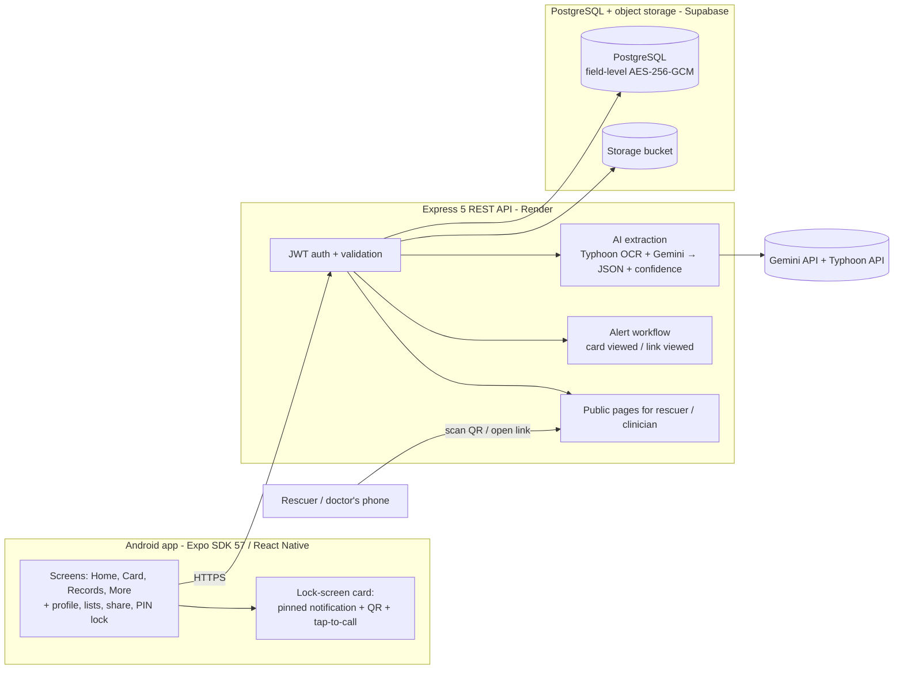

# MediFirstCard — Presentation Handout

040333215 Smart Technology 2026 · Mini Project · Live demo Wed 7 Oct 2026 · Prototype for educational purposes only
Team: ปิยนุช นุ่มน้อย (Project Manager / System Analyst) · เหม่หลิ๋ง ตัน (UX/UI Designer & Medical Consultant) · ณัฐพัชร์ ทัศนะเมธี (Lead Developer / Full-stack)

> Square-bracket items like [Gemini live] depend on cloud keys/accounts being added before the demo. Everything else is built and was verified on a real phone on 4 Sep 2026.

## Page 1 — Problem, users, concept

**The problem.** In an accident, or when a patient is unconscious, the people who arrive first cannot see the information that matters most — blood group, chronic illness, drug allergies, who to call — because the phone is locked. Later, medical certificates and treatment records are scattered across hospitals, on paper, and get lost when a patient changes hospital.

**Who it is for.** Primary: the general public, especially people with chronic illness, the elderly, and people at higher accident risk. Supporting: doctors, nurses and emergency rescue workers (1669) who need life-saving information in the first minute.

**The concept in one line.** *Your emergency card on the lock screen; your medical records behind your PIN; a QR code that lets a rescuer or doctor see exactly what you chose to share.*

**Three pillars (from our proposal).**
1. **Emergency Health Card on the lock screen.** The user chooses which fields are visible. The card is pinned to the lock screen as a non-dismissable notification on every Android phone, with a **Call 1669** button and a **Call** button next to each emergency contact. A QR code on the card opens a read-only web page for rescuers with the same tap-to-call links.
2. **Medical records & certificates archive.** Photograph a medical certificate (camera or gallery); the app hashes it (duplicates rejected), uploads it to encrypted storage and an AI model reads the fields (hospital, doctor, licence number, date, diagnosis, rest days, medications) with a confidence score for each field. The user checks and corrects the red fields before saving; certificates get an automatic one-month validity; a clinician can be given an expiring, passcode-protected link.
3. **Security & privacy.** Account password, an app PIN with fingerprint/face unlock, AES-256-GCM encryption of every health-content field in the database, token rotation with reuse detection, PDPA consent with withdrawal and a one-tap account deletion that erases everything.

**Why it matters in Thailand.** Android's own emergency-info page is minimal and hidden behind two taps; Thai medical certificates follow the Medical Council form and are valid for one month; drug-allergy cards (บัตรแพ้ยา) are still paper. MediFirstCard keeps a patient-held copy of all of this and does not replace หมอพร้อม or Health Link — it complements them.

<!-- pagebreak -->

## Page 2 — Architecture and advanced features

**Stack.** React Native with Expo SDK 57 (TypeScript, Expo Router, React Native Paper, Sarabun font) · Node.js 24 + Express 5 + Drizzle ORM · PostgreSQL (embedded PGlite for local/grader runs, Supabase in the cloud) · API hosted on Render · Typhoon OCR (SCB 10X) + Google Gemini for document extraction, both free · everything on free tiers ($0). The grader can run the whole system on one laptop with no accounts: `npm run api:dev` + `npx expo run:android`.

**Data flow for one scanned certificate.** Photo → resized to 1600 px JPEG on the phone → SHA-256 hash (duplicates rejected) → upload → confirm → AI returns structured JSON with a confidence and an evidence snippet per field → user reviews (red fields highlighted, every field editable) → encrypted row saved with kind, facility, doctor, licence, issue date and validity → visible in the list and detail screens, shareable to a clinician.

**Advanced features declared (rubric: ≥5 from ≥3 categories, ≥2 genuine integrations).**

| # | Feature | Category | Genuine integration |
|---|---|---|---|
| A1 | Custom Express 5 + TypeScript REST API (36 routes) with JWT access/refresh rotation and reuse detection, hosted on Render | 2 · API / Backend | Yes |
| A2 | PostgreSQL + object storage: structured schema with timestamps and metadata, AES-256-GCM encryption of all health-content text, SHA-256 duplicate detection, hard-delete with tombstone | 1 · Data & Storage | Yes |
| A3 | AI document extraction: Thai OCR (Typhoon OCR by SCB 10X) plus a vision LLM (Google Gemini) read a Thai/English medical certificate into structured fields with a per-field confidence score and an evidence snippet; a deterministic mock ships for offline demos; the user reviews red fields before saving | 4 · AI / ML | Yes [live once keys are added] |
| A4 | Automated alert workflow: viewing the public emergency card or a clinician link fires a backend event → in-app notification + e-mail to the owner (Resend) | 2 · Automation | Yes |
| A5 | PDPA consent screen, lock-screen exposure warning, role-based views (owner / rescuer / clinician), clinical status colours, elderly-first type sizes, Thai/English | 5 · Medical UI/UX | — |
| A6 | Device features: pinned lock-screen notification on a public-visibility channel, dialer intent (tap-to-call + 1669), camera / photo picker, fingerprint or face unlock with a local PIN | 3 · Device / Sensors | — |

Additional features built: emergency contacts with informed-consent flag and call priority · clinician share link with passcode, expiry, view count, revoke and access log · profile-completeness checklist · withdraw consent / delete account · Server URL switch for demos.

<!-- pagebreak -->

## Page 3 — Demo flow, limitations, responsible use

**Live demo (about 5 minutes).** Phone mirrored on the projector (`scrcpy`); API log visible beside it.

| Step | What you will see | What we are proving |
|---|---|---|
| 1. App running (PM) | Launch → PIN / fingerprint gate → dashboard with the profile-completeness checklist; tab navigation | The app runs; navigation; local security |
| 2. Input (UX) | Add an emergency contact: an invalid phone is rejected, then the contact appears with a Call button; add a "severe" drug allergy → red line on the card | Input + validation |
| 3. Integration (DEV) | Photograph a synthetic certificate → API log shows create / upload / extract → review screen with one red low-confidence field, corrected → record saved (encrypted row) [Gemini live if keys added; otherwise the mock result] | REST API, database, AI with confidence |
| 4. Result (DEV) | Card tab: Call 1669 + contact Call button opens the dialer; turn on "Show card on lock screen" → pull down the shade / lock the phone → the pinned card is readable without unlocking | The lock-screen promise, tap-to-call |
| 5. Sharing + alert (UX/PM) | Second phone scans the QR → rescuer page with tel: links; Alerts show "your card was viewed"; clinician link with passcode opened on the laptop, wrong passcode rejected, then revoke → "expired" | Role-based views, automation |
| 6. Errors (UX) | Wrong PIN → attempts counter; duplicate scan → "already added"; API stopped → "cannot reach the server" instead of a crash | Error handling |
| 7. Close (PM) | Privacy: withdraw consent revokes links; delete account; disclaimer, architecture and limitations for Q&A | Responsible use |

**Limitations we state openly.**
- The lock-screen card is a pinned notification: how much text the lock screen shows depends on the phone's notification-privacy setting. The Android 16 lock-screen widget hub is not targeted.
- iOS is designed (WidgetKit) but not built: no Mac, no paid Apple account.
- AI extraction is assistive, not authoritative: Thai handwriting is unverified; every field is reviewed by the user. Document images are sent to Google's Gemini API and SCB 10X's Typhoon API (free tiers that may use inputs to improve their services); the consent screen says so, and we demo only with synthetic documents. Until the keys are configured the app uses a deterministic example result and says so on screen.
- Alerts are in-app and by e-mail (Resend); on the free e-mail tier without a verified domain the e-mail can only reach the account owner's address, so the demo shows the in-app alert.
- Prototype values: five wrong PINs sign the user out, single server encryption key, free-tier server that sleeps after 15 minutes.
- Not connected to หมอพร้อม / Health Link; not PDPA-audited; no guardian flow for minors; no offline queue (the card needs the API once per session).

**Responsible use.** MediFirstCard is a student prototype for educational purposes only. It is not a medical device and does not diagnose, treat, cure or prevent any condition. Emergency information is self-reported and unverified; medical staff must confirm blood group, allergies and medications by standard procedures. Anything shown on the lock screen can be read by anyone holding the phone, so the user chooses each field and is warned first. Health data is sensitive personal data under the Thai PDPA: the app asks for explicit consent, states the purposes and retention, names the AI providers, and lets the user withdraw and delete everything.

**Future work.** Live Gemini + Typhoon on the free tiers · Supabase + Render deployment · iOS WidgetKit build · edge-detecting document scanner · vaccination module · offline cache · push notifications · FHIR export to hospitals · NFC card.

<!-- pagebreak -->

## Page 4 — Speaker script and Q&A

**Intro video / opening (3 minutes).** Say the Thai line; the English line is the subtitle.

| Beat | Thai | English |
|---|---|---|
| 0:00 Problem | เวลาเกิดอุบัติเหตุ คนที่มาช่วยเราคนแรกมองไม่เห็นข้อมูลที่สำคัญที่สุด เพราะโทรศัพท์ล็อกอยู่ และใบรับรองแพทย์ของเราก็กระจัดกระจายอยู่ตามโรงพยาบาลต่าง ๆ | When an accident happens, the first person to help cannot see what matters most, because the phone is locked. And our medical certificates are scattered across hospitals. |
| 0:20 Users | กลุ่มเป้าหมายคือคนทั่วไป โดยเฉพาะผู้สูงอายุและผู้มีโรคประจำตัว และผู้ช่วยเหลือคือแพทย์ พยาบาล และกู้ชีพ 1669 | Our users are the general public, especially the elderly and people with chronic illness; our supporting users are doctors, nurses and 1669 rescuers. |
| 0:35 Concept | MediFirstCard คือบัตรฉุกเฉินบนหน้าจอล็อก คลังเอกสารการแพทย์หลัง PIN และ QR ที่ให้กู้ชีพหรือหมอเห็นเฉพาะสิ่งที่เราเลือกแชร์ | MediFirstCard is an emergency card on the lock screen, a medical archive behind a PIN, and a QR code that shows rescuers or doctors only what you chose to share. |
| 0:55 Features | ผู้ใช้เลือกได้ว่าจะแสดงอะไรบนหน้าจอล็อก กดโทร 1669 หรือโทรหาผู้ติดต่อฉุกเฉินได้ทันที ถ่ายใบรับรองแพทย์แล้ว AI อ่านข้อมูลให้พร้อมคะแนนความมั่นใจ ผู้ใช้ตรวจสอบก่อนบันทึก ทุกอย่างเข้ารหัส และแชร์ให้หมอผ่านลิงก์ที่มีรหัสและหมดอายุได้ | You choose what appears on the lock screen, and can call 1669 or an emergency contact with one tap. Photograph a certificate and the AI reads it with a confidence score per field; you check before saving. Everything is encrypted, and you can share with a doctor through a passcode-protected link that expires. |
| 1:35 Architecture | แอป React Native คุยกับ REST API ที่เขียนด้วย Express ข้อมูลเก็บใน PostgreSQL โดยเข้ารหัสระดับฟิลด์ และใช้ Typhoon OCR ของ SCB 10X ร่วมกับ Gemini ของ Google อ่านเอกสาร | The React Native app talks to an Express REST API; data lives in PostgreSQL with field-level encryption; SCB 10X's Typhoon OCR and Google's Gemini read the documents. |
| 2:00 Advanced features | เราเลือก 6 ฟีเจอร์ขั้นสูงจาก 5 หมวด โดย 4 รายการเป็นการเชื่อมต่อระบบจริง: API, ฐานข้อมูล, AI และ workflow แจ้งเตือนอัตโนมัติ | We chose six advanced features from five categories; four are genuine system integrations: the API, the database, the AI, and the automated alert workflow. |
| 2:30 Limitations | นี่คือต้นแบบเพื่อการศึกษา ไม่ใช่เครื่องมือแพทย์ บัตรบนหน้าจอล็อกเป็นการแจ้งเตือนแบบปักหมุด ข้อความที่เห็นขึ้นกับการตั้งค่าความเป็นส่วนตัวของเครื่อง และ AI เป็นเพียงผู้ช่วย ผู้ใช้ต้องตรวจสอบเสมอ | This is an educational prototype, not a medical device. The lock-screen card is a pinned notification, so how much shows depends on the phone's privacy setting; the AI only assists and the user always checks. |

**Live-demo lines (say while the screen is doing the work).**
- Step 3, while the AI runs: "ระบบกำลังส่งภาพไปยัง API ของเรา แล้ว AI จะคืนค่าเป็น JSON พร้อมคะแนนความมั่นใจของแต่ละช่อง — ช่องสีแดงคือช่องที่ AI ไม่แน่ใจ ผู้ใช้ต้องยืนยันเอง" / "The image goes to our API; the AI returns JSON with a confidence per field — red fields are the ones the AI is unsure about, so the user must confirm them."
- Step 4, after pulling down the shade: "นี่คือสิ่งที่กู้ชีพเห็นโดยไม่ต้องปลดล็อก: หมู่เลือด ยาที่แพ้ และเบอร์ติดต่อฉุกเฉิน — เฉพาะที่ผู้ใช้เลือกไว้ และกดโทรได้เลย" / "This is what a rescuer sees without unlocking: blood group, drug allergy and the emergency contact — only what the user chose, and they can call with one tap."
- Step 5, on the clinician link: "หมอได้ลิงก์ที่มีรหัส 4 หลัก ใส่ผิด 5 ครั้งลิงก์จะถูกยกเลิก และผู้ป่วยยกเลิกเองได้ทุกเมื่อ" / "The doctor gets a link with a 4-digit passcode; five wrong tries revoke it, and the patient can revoke it at any time."
- If the free server is asleep: "เซิร์ฟเวอร์ฟรีของเราหลับอยู่ นี่คือ API ตัวเดียวกันที่รันบนโน้ตบุ๊ก" / "Our free host is asleep; this is the same API running on the laptop."

**Q&A cheat sheet.**

| Likely question | Answer |
|---|---|
| Why not use the phone's built-in Medical ID? | It exists and we tell users to fill it in too. Ours adds a lock-screen card you can read without any taps, tap-to-call for 1669 and your contacts, Thai-language drug-allergy semantics, the records archive, and a QR/link the patient controls and can revoke. |
| Is the card really on the lock screen? | Yes: it is a pinned notification on a channel with public lock-screen visibility, so it is readable without unlocking on every Android phone; the phone's own privacy setting can hide notification text, and we say so. |
| Where is the encryption? | TLS in transit; the database host encrypts disks at rest; and our API additionally encrypts every health-content text column with AES-256-GCM before it reaches the database, so the table on the projector shows base64, not diagnoses. |
| What exactly goes to the AI, and is it legal? | Only the document image (and its OCR text) with the JSON schema — never the profile. The consent screen names both providers and the purpose; because their free tiers may use inputs to improve the services, the demo uses synthetic documents only; the user can decline AI extraction. It is a prototype and not PDPA-audited. |
| How do you handle a wrong AI answer? | Every field carries a confidence and the text the model read; low-confidence fields are highlighted in red and every field is editable before saving. The user is always the final editor. |
| What if the network fails during the demo? | The app shows "cannot reach the server" instead of crashing, and the API runs on the laptop (embedded PostgreSQL, no accounts) with the phone connected over USB. |
| Why Express and PostgreSQL instead of Firebase? | The proposal promised a REST API we can explain line by line; relational records with validation and per-column encryption fit PostgreSQL; both are on free tiers, and the embedded PGlite lets a grader run everything with no account. |
| Which category is the "genuine integration"? | Four: the Express backend (API), the database + storage, the AI inference API, and the alert workflow that turns a public-page view into a notification. |
| What did each member do? | DEV led the architecture and built the API and the app with an AI coding assistant, reviewing every change on the phone. UX designed the screens and tokens, wrote the Thai/English strings, made the synthetic sample documents and the video. PM wrote the docs and README, built the seed data and fixtures, ran the weekly test plan on the phone, set up the cloud accounts and organised the demo. |
| What would you do next? | Live Gemini + Typhoon, cloud deployment, iOS WidgetKit, a real document scanner, vaccination records, push alerts, and FHIR export so a hospital can import the summary. |
